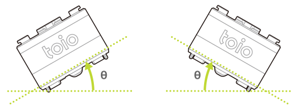
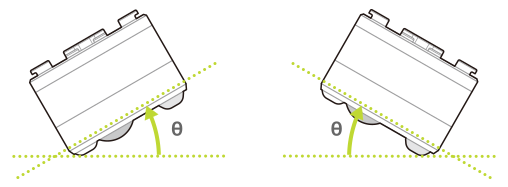

キューブは自身の通信仕様のバージョン情報や各種設定情報を内部に保存しています。
これらの情報は以下の特性（characteristic）を使うことで取得や変更ができます。

| プロパティ          | 値                                                             |
| ------------------- | -------------------------------------------------------------- |
| Characteristic UUID | 10B201FF-5B3B-4571-9508-CF3EFCD7BBAE                           |
| Properties          | [Write](#書き込み操作), [Read](#読み出し操作), [Notify](#通知) |
| Descriptor          | Configuration                                                  |

## 書き込み操作

> 書き込み操作によって各種設定値などを変更できますが、キューブの接続が切れるとすべての変更は破棄され初期値に戻ります。

### BLE プロトコルバージョンの要求

以下のデータを書き込むことでキューブの BLE プロトコルバージョンを要求できます。結果の取得方法は [BLE プロトコルバージョンの取得](#ble-プロトコルバージョンの取得)を参照してください。

| データ位置 | タイプ | 内容       | 例                                                          |
| ---------- | ------ | ---------- | ----------------------------------------------------------- |
| 0          | UInt8  | 設定の種類 | `0x01`（BLE プロトコルバージョンの要求） |
| 1          | UInt8  | Reserved   | `0x00`                                                      |

### 水平検出のしきい値設定

[モーションセンサー](sensor.md)で取得できる水平検出はキューブの底面と水平面のなす角度（下の図の θ）がしきい値を超えると`0x00`（水平でない）となります。以下のデータを書き込むことでこのしきい値を変更できます。

| データ位置 | タイプ | 内容       | 例                                                  |
| ---------- | ------ | ---------- | --------------------------------------------------- |
| 0          | UInt8  | 設定の種類 | `0x05`（水平検出のしきい値設定） |
| 1          | UInt8  | Reserved   | `0x00`                                              |
| 2          | UInt8  | しきい値   | `0x0A` (10 度）                                     |

しきい値はロール方向とピッチ方向の回転の両方に適用されます。しきい値の範囲と初期値は以下のとおりです。

**ロール方向**

**ピッチ方向**

| プロパティ | 値の範囲                 | 初期値     |
| ---------- | ------------------------ | ---------- |
| しきい値   | `1` 以上 `45` 以下（度） | `45`（度） |

### 衝突検出のしきい値設定

[モーションセンサー](sensor.md)で取得できる衝突検出はキューブの受ける衝突の強さがしきい値を超えると`0x01`（衝突あり）となります。以下のデータを書き込むことでこのしきい値を変更できます。

| データ位置 | タイプ | 内容       | 例                                                  |
| ---------- | ------ | ---------- | --------------------------------------------------- |
| 0          | UInt8  | 設定の種類 | `0x06`（衝突検出のしきい値設定） |
| 1          | UInt8  | Reserved   | `0x00`                                              |
| 2          | UInt8  | しきい値   | `0x0A` (level 10)                                   |

しきい値の範囲と初期値は以下のとおりです。値の大きは衝突の大きさを意味します。

| プロパティ | 値の範囲                   | 初期値      |
| ---------- | -------------------------- | ----------- |
| しきい値   | `1` 以上 `10` 以下 (level) | `7` (level) |

### ダブルタップ検出の時間間隔の設定

[モーションセンサー](sensor.md)で取得できるダブルタップ検出はキューブが一度タップされてから一定時間内に再度タップされると、`1`（ダブルタップあり）となります。以下のデータを書き込むことでこのタップの時間間隔を変更できます。

| データ位置 | タイプ | 内容       | 例                                                            |
| ---------- | ------ | ---------- | ------------------------------------------------------------- |
| 0          | UInt8  | 設定の種類 | `0x17`（ダブルタップ検出の時間間隔の設定） |
| 1          | UInt8  | Reserved   | `0x00`                                                        |
| 2          | UInt8  | 時間間隔   | `0x07` (level 7)                                              |

時間間隔の範囲と初期値は以下のとおりです。値が大きくなると、時間間隔も長くなります。

| プロパティ | 値の範囲                  | 初期値      |
| ---------- | ------------------------- | ----------- |
| 時間間隔   | `0` 以上 `7` 以下 (level) | `5` (level) |

### 読み取りセンサーの ID 通知設定

読み取りセンサーの [Position ID](id.md#position-id) および [Standard ID](id.md#standard-id) の通知頻度を設定します。**「最小通知間隔」と「通知条件」の両方を満たした場合に通知が行われます**。結果の取得方法は[読み取りセンサーの ID 通知設定の応答](#読み取りセンサーの-id-通知設定の応答)を参照してください。

| データ位置 | タイプ | 内容         | 例                                                          |
| ---------- | ------ | ------------ | ----------------------------------------------------------- |
| 0          | UInt8  | 設定の種類   | `0x18`（読み取りセンサーの ID 通知設定） |
| 1          | UInt8  | Reserved     | `0x00`                                                      |
| 2          | UInt8  | 最小通知間隔 | `0x01`（10 ミリ秒）                                         |
| 3          | UInt8  | 通知条件     | `0x01`（変化時のみ通知）                                    |

#### 最小通知間隔

通知間隔の最小値を設定します。値の範囲と初期値は以下のとおりです。単位は 10 ミリ秒です。例えば `5` を設定した場合は 50 ミリ秒より長い間隔で通知が行われます。あくまで通知間隔の最小値であり、一定の通知間隔を保証するものではありません。またセントラル側の状態によっても通知間隔は変動しますのでご注意ください。

| プロパティ   | 値の範囲            | 初期値           |
| ------------ | ------------------- | ---------------- |
| 最小通知間隔 | `0` 以上 `255` 以下 | `1`（10 ミリ秒） |

#### 通知条件

通知する条件を以下の 3 つのタイプから 1 つ選択します。初期値は `0xff` です。

| 通知条件 | 内容                                                                                          |
| -------- | --------------------------------------------------------------------------------------------- |
| `0x00`   | 通知内容に変化がなくても通知を行います                                                        |
| `0x01`   | 座標は 2 以上、角度は 3 度以上の変化がある場合に通知を行います                                |
| `0xff`   | 座標と角度がに変化がない場合は 300 ミリ秒の間通知を停止しますがそれ以外の場合は通知を行います |

### 読み取りセンサーの ID missed 通知設定

読み取りセンサーの [Position ID missed](id.md#position-id-missed) および [Standard ID missed](id.md#standard-id-missed) の通知感度を設定します。結果の取得方法は[読み取りセンサーの ID missed 通知設定の応答](#読み取りセンサーの-id-missed-通知設定の応答)を参照してください。

| データ位置 | タイプ | 内容       | 例                                                                 |
| ---------- | ------ | ---------- | ------------------------------------------------------------------ |
| 0          | UInt8  | 設定の種類 | `0x19`（読み取りセンサーの ID missed 通知設定） |
| 1          | UInt8  | Reserved   | `0x00`                                                             |
| 2          | UInt8  | 通知感度   | `0x0A`（100 ミリ秒）                                               |

#### 通知感度

キューブが Position ID や Standard ID が印刷されたものの上から取り除かれた時の通知感度を設定します。値の範囲と初期値は以下のとおりです。単位は 10 ミリ秒です。たとえば `5` を設定した場合は、キューブがマットやカードから取り除かれてから 50 ミリ秒後に missed が通知されます。取り除かれてから 50 ミリ秒以内に再びマットやカードの上に戻された場合は通知を行いません。

| プロパティ | 値の範囲            | 初期値           |
| ---------- | ------------------- | ---------------- |
| 通知感度   | `0` 以上 `255` 以下 | `7`（70 ミリ秒） |

### _磁気センサーの設定_

以下のデータを書き込むことで[磁気センサー](magnetic_sensor.md)の機能の有効化・無効化を設定します。デフォルトでは無効化されています。結果の取得方法は[磁気センサーの設定の応答](#磁気センサーの設定の応答)を参照してください。

| データ位置 | タイプ | 内容         | 例                                                  |
| ---------- | ------ | ------------ | --------------------------------------------------- |
| 0          | UInt8  | 設定の種類   | `0x1b`（磁気センサー機能の設定） |
| 1          | UInt8  | Reserved     | `0x00`                                              |
| 2          | UInt8  | 機能設定     | `0x01`（磁石の状態検出の有効化）                              |
| 3          | UInt8  | 通知間隔     | `0x01`（20 ミリ秒）                                         |
| 4          | UInt8  | 通知条件     | `0x01`（変化時のみ通知）                                    |

設定値は以下のとおりです。  
磁石の状態検出と磁力の検出を同時に有効化することはできません。

| 機能設定 | 意味                   |
| -------- | ---------------------- |
| `0x00`   | 無効化（初期値）       |
| `0x01`   | 磁石の状態検出の有効化 |
| `0x02`   | 磁力の検出の有効化     |

#### **通知間隔**

通知の間隔を設定します。単位は20ミリ秒です。`0` を設定した場合は通知無効となります。
高精度位傾き情報の通知間隔設定とは単位が異なるので注意してください。

| プロパティ   | 値の範囲                               |
| ------------ | -------------------------------------- |
| 通知間隔     | `0` 以上 `255` 以下（0は通知無効設定） |

#### **通知条件**

通知の条件を設定します。`0x00` を設定した場合は変化がなくても通知間隔に従い通知を行います。
`0x01` を設定した場合は磁石の状態に変化があったときだけ通知を行います。ただし、変化が激しい場合でも上記の通知間隔設定より短い間隔で通知されることはありません。

| 機能設定 | 意味                       |
| -------- | -------------------------- |
| `0x00`   | 変化がなくても通知         |
| `0x01`   | 変化があったときだけ通知   |

### モーターの速度情報の取得の設定

以下のデータを書き込むことで[モーター - モーターの速度情報の取得](motor.md#モーターの速度情報の取得)の有効化・無効化を設定します。デフォルトでは無効化されています。結果の取得方法は[モーターの速度情報の取得の設定の応答](#モーターの速度情報の取得の設定の応答)を参照してください。

| データ位置 | タイプ | 内容       | 例                                                    |
| ---------- | ------ | ---------- | ----------------------------------------------------- |
| 0          | UInt8  | 設定の種類 | `0x1c`（モーターの速度取得の設定） |
| 1          | UInt8  | Reserved   | `0x00`                                                |
| 2          | UInt8  | 設定値     | `0x01`（有効化）                                      |

設定値は以下のとおりです。

| 設定値 | 意味             |
| ------ | ---------------- |
| `0x00` | 無効化（初期値） |
| `0x01` | 有効化           |

### **姿勢角検出の設定**

以下のデータを書き込むことで[姿勢角検出](high_precision_tilt_sensor.md)機能の有効化・無効化を設定します。デフォルトでは無効化されています。結果の取得方法は[姿勢角検出設定の応答](#姿勢角検出の設定の応答)を参照してください。

| データ位置 | タイプ | 内容            | 例                                                  |
| ---------- | ------ | --------------- | --------------------------------------------------- |
| 0          | UInt8  | 設定の種類      | `0x1d`（姿勢角検出の設定）       |
| 1          | UInt8  | Reserved        | `0x00`                                              |
| 2          | UInt8  | 通知内容の種類  | `0x01`（オイラー角）                                |
| 3          | UInt8  | 通知間隔        | `0x01`（10 ミリ秒）                                 |
| 4          | UInt8  | 通知条件        | `0x01`（変化時のみ通知）                            |

通知内容の種類は以下のとおりです。

| 通知内容の種類 | 意味                   |
| -------------- | ---------------------- |
| `0x01`         | オイラー角での通知     |
| `0x02`         | クォータニオンでの通知 |

#### **通知間隔**

通知の間隔を設定します。単位は10ミリ秒です。`0` を設定した場合は通知無効となります。
磁気センサーの通知間隔設定とは単位が異なるので注意してください。

| プロパティ   | 値の範囲                                |
| ------------ | --------------------------------------- |
| 通知間隔     | `0` 以上 `255` 以下（0は通知無効設定）  |

#### **通知条件**

通知の条件を設定します。`0x00` を設定した場合は変化がなくても通知間隔に従い通知を行います。
`0x01` を設定した場合は傾きの状態に変化があったときだけ通知を行います。ただし、変化が激しい場合でも上記の通知間隔設定より短い間隔で通知されることはありません。

| 機能設定 | 意味                       |
| -------- | -------------------------- |
| `0x00`   | 変化がなくても通知         |
| `0x01`   | 変化があったときだけ通知   |

## 読み出し操作

### BLE プロトコルバージョンの取得

要求方法に関しては [BLE プロトコルバージョンの要求](#ble-プロトコルバージョンの要求)を参照してください。

| データ位置 | タイプ | 内容                                      | 例                                                          |
| ---------- | ------ | ----------------------------------------- | ----------------------------------------------------------- |
| 0          | UInt8  | 設定の種類                                | `0x81`（BLE プロトコルバージョンの取得） |
| 1          | UInt8  | Reserved                                  | `0x00`                                                      |
| 2          | String | BLE プロトコルバージョン（5 bytes utf-8） | &nbsp;                                                      |

### 読み取りセンサーの ID 通知設定の応答

[読み取りセンサーの ID 通知設定の応答](#読み取りセンサーの-id-通知設定)を書き込むと結果に応じて以下の応答を行います。

| データ位置 | タイプ | 内容       | 例                                                                |
| ---------- | ------ | ---------- | ----------------------------------------------------------------- |
| 0          | UInt8  | 設定の種類 | `0x98`（読み取りセンサーの ID 通知設定の応答） |
| 1          | UInt8  | Reserved   | `0x00`                                                            |
| 2          | UInt8  | 結果の値   | `0x00`（設定成功）                                                |

結果の値の意味は以下のとおりです。

| 結果の値    | 意味         |
| ----------- | ------------ |
| `0x00`      | OK・設定成功 |
| `0x00` 以外 | NG・設定失敗 |

### 読み取りセンサーの ID missed 通知設定の応答

[読み取りセンサーの ID missed 通知設定](#読み取りセンサーの-id-missed-通知設定)を書き込むと結果に応じて以下の応答を行います。

| データ位置 | タイプ | 内容       | 例                                                                       |
| ---------- | ------ | ---------- | ------------------------------------------------------------------------ |
| 0          | UInt8  | 設定の種類 | `0x99`（読み取りセンサーの ID missed 通知設定の応答） |
| 1          | UInt8  | Reserved   | `0x00`                                                                   |
| 2          | UInt8  | 結果の値   | `0x00`（設定成功）                                                       |

結果の値の意味は以下のとおりです。

| 結果の値    | 意味         |
| ----------- | ------------ |
| `0x00`      | OK・設定成功 |
| `0x00` 以外 | NG・設定失敗 |

### 磁気センサーの設定の応答

[磁気センサーの設定](#_磁気センサーの設定_)を書き込むと結果に応じて以下の応答を行います。

| データ位置 | タイプ | 内容       | 例                                                    |
| ---------- | ------ | ---------- | ----------------------------------------------------- |
| 0          | UInt8  | 設定の種類 | `0x9b`（磁気センサーの設定の応答） |
| 1          | UInt8  | Reserved   | `0x00`                                                |
| 2          | UInt8  | 結果の値   | `0x00`（設定成功）                                    |

結果の値の意味は以下のとおりです。

| 結果の値    | 意味         |
| ----------- | ------------ |
| `0x00`      | OK・設定成功 |
| `0x00` 以外 | NG・設定失敗 |

### モーターの速度情報の取得の設定の応答

[モーターの速度情報の取得の設定](#モーターの速度情報の取得の設定)を書き込むと結果に応じて以下の応答を行います。

| データ位置 | タイプ | 内容       | 例                                                                |
| ---------- | ------ | ---------- | ----------------------------------------------------------------- |
| 0          | UInt8  | 設定の種類 | `0x9c`（モーターの速度情報の取得の設定の応答） |
| 1          | UInt8  | Reserved   | `0x00`                                                            |
| 2          | UInt8  | 結果の値   | `0x00`（設定成功）                                                |

結果の値の意味は以下のとおりです。

| 結果の値    | 意味         |
| ----------- | ------------ |
| `0x00`      | OK・設定成功 |
| `0x00` 以外 | NG・設定失敗 |

### **姿勢角検出の設定の応答**

[姿勢角検出の設定](#姿勢角検出の設定)を書き込むと結果に応じて以下の応答を行います。

| データ位置 | タイプ | 内容       | 例                                                    |
| ---------- | ------ | ---------- | ----------------------------------------------------- |
| 0          | UInt8  | 設定の種類 | `0x9d`（姿勢角検出の設定の応答）   |
| 1          | UInt8  | Reserved   | `0x00`                                                |
| 2          | UInt8  | 結果の値   | `0x00`（設定成功）                                    |

結果の値の意味は以下のとおりです。

| 結果の値    | 意味         |
| ----------- | ------------ |
| `0x00`      | OK・設定成功 |
| `0x00` 以外 | NG・設定失敗 |

## 通知

[読み出し操作](#読み出し操作)で得られるデータは通知でも受け取ることが出来ます。

