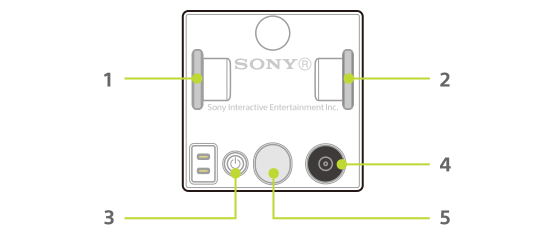

キューブの各部の名前とそれを使うための通信仕様を紹介します。

| 番号 | 名前               | 関連する機能・通信仕様                   |
| ---- | ------------------ | ---------------------------------------- |
| 1    | タイヤ（右）       | [モーター](motor.md)                     |
| 2    | タイヤ（左）       | [モーター](motor.md)                     |
| 3    | 電源ボタン         | -                                        |
| 4    | 読み取りセンサー   | [読み取りセンサー](id.md)                |
| 5    | 機能ボタン／ランプ | [ボタン](button.md) / [ランプ](light.md) |
