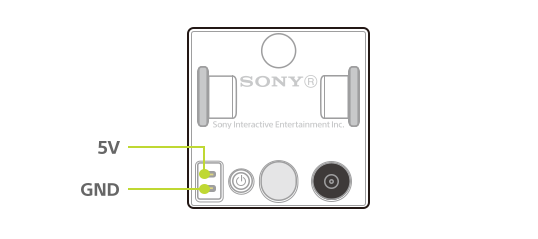

## 速度

キューブに何も載せない状態での水平面における最高速度は以下のとおりです。

| 状態 | 速度                |
| ---- | ------------------- |
| 直進 | 350 ミリメートル/秒 |
| 回転 | 1500 度/秒          |

## 積載重量

最大積載重量は 200 グラムです。ただし、200 グラム以下であっても重心バランスによっては正しく走行しないことがあります。

## バッテリー性能

| 項目     | 内容               |
| -------- | ------------------ |
| 種類     | リチウムイオン電池 |
| 公称電圧 | 3.7 V              |
| 公称容量 | 260 mAh            |

## 充電用端子

### 端子の極性

長い方のピンがGNDです。

### 入力電圧 / 入力電流

| 項目     | 内容   |
| -------- | ------ |
| 入力電圧 | DC 5 V |
| 入力電流 | 0.3 A  |

### 対応レセプタクルコネクタ

| 項目       | 内容                            |
| ---------- | ------------------------------- |
| メーカー名 | Foxconn Interconnect Technology |
| 型番       | BBRC2H1-B9603-7H                |
