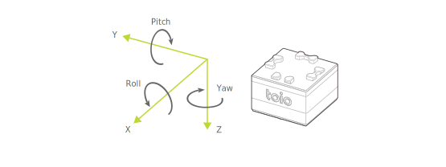

キューブのモーションセンサー（6 軸検出システム）の出力値をもとに姿勢推定アルゴリズムによってキューブの姿勢角を算出した値（推定値）を提供します。  
この姿勢角はモーションセンサーの生値ではなく、加速度・角速度をキューブ内で合成して算出した値であるため、姿勢角の値には常に一定の誤差やずれ（ドリフト）を含みます。

> この機能は**デフォルトでは無効**になっています。[設定 - 姿勢角検出の設定](configuration.md#姿勢角検出の設定)で有効化することではじめて利用可能になります。

姿勢角検出は以下の特性（characteristic）を使うことで取得できます。特性は[モーション検出](sensor.md)および[磁気センサー](magnetic_sensor.md)と同じです。

| プロパティ          | 値                                                                                 |
| ------------------- | ---------------------------------------------------------------------------------- |
| Characteristic UUID | 10B20106-5B3B-4571-9508-CF3EFCD7BBAE                                               |
| Properties          | [Write](#書き込み操作), [Read](#読み出し操作--通知), [Notify](#読み出し操作--通知) |
| Descriptor          | Sensor Information                                                                 |

## **書き込み操作**

### 姿勢角検出の要求

以下のデータを書き込むことで姿勢角情報を要求できます。キューブは要求を受け取ると、必ず 1 回姿勢角の通知を行います。

| データ位置 | タイプ | 内容           | 例                                                  |
| ---------- | ------ | ---------------| --------------------------------------------------- |
| 0          | UInt8  | 情報の種類     | `0x83` (姿勢角検出の要求）       |
| 1          | UInt8  | 通知内容の種類 | `0x01` (オイラー角での通知）     |

通知内容の種類は以下のとおりです。

| 通知内容の種類 | 意味                   |
| -------------- | ---------------------- |
| `0x01`         | オイラー角での通知     |
| `0x02`         | クォータニオンでの通知 |

## **読み出し操作 / 通知**

キューブの姿勢角が変化すると、この特性は BLE セントラルに情報を通知します。
通知される情報は読み出し操作でも取得できます。

> 特性は[モーション検出](sensor.md)および[磁気センサー](magnetic_sensor.md)と共通です。
これらの情報も取得されますので、利用の際には[モーション検出 - 読み出し操作 / 通知](sensor.md#読み出し操作--通知)および[磁気センサー - 読み出し操作 / 通知](magnetic_sensor.md#読み出し操作--通知)も確認してください。

### 姿勢角情報の取得（オイラー角での通知）

通知内容の種類をオイラー角での通知にした場合は以下のデータが取得できます。

| データ位置 | タイプ | 内容                 | 例                                              |
| ---------- | ------ | -------------------- | ----------------------------------------------- |
| 0          | UInt8  | 情報の種類           | `0x03`（姿勢角検出）         |
| 1          | UInt8  | 通知内容の種類       | `0x01`（オイラー角での通知） |
| 2          | Int16  | Roll（ロール/X軸）   | `0x0000`（0°）                                  |
| 4          | Int16  | Pitch（ピッチ/Y軸）  | `0x00B4`（180°）                                |
| 6          | Int16  | Yaw（ヨー/Z軸）      | `0xFF4E`（-178°）                               |

#### 角度

角度の範囲は -179°(0xFF4E) から 180°(0x00B4) です。

回転順序はYaw（ヨー/Z軸）、Pitch（ピッチ/Y軸）、Roll（ロール/X軸）の順です。  
ロール角とピッチ角は、キューブのタイヤ面を下面として水平に置いた状態が0°です。ヨー角は、キューブが起動したときの向きが0°です。

#### 誤差

Z軸まわりの回転（オイラー角におけるヨー角）に対しては重力加速度を使った補正を行えないため誤差が蓄積されます。 以下はその影響の具体例です。

* キューブを動かしていないのに、数秒に1°程度ヨー角がずれる
* Z軸を中心軸としてキューブを1回転させると、ヨー角が数°ずれる

### 姿勢角情報の取得（クォータニオンでの通知）

通知内容の種類をクォータニオンでの通知にした場合は以下のデータが取得できます。

| データ位置 | タイプ | 内容           | 例                                                  |
| ---------- | ------ | -------------- | --------------------------------------------------- |
| 0          | UInt8  | 情報の種類     | `0x03`（姿勢角検出）             |
| 1          | UInt8  | 通知内容の種類 | `0x02`（クォータニオンでの通知） |
| 2          | Int16  | w              | `0x0000`（0）                                       |
| 4          | Int16  | x              | `0x2710`（10,000）                                  |
| 6          | Int16  | y              | `0x0000`（0）                                       |
| 8          | Int16  | z              | `0x0000`（0）                                       |

#### 値の範囲

値の範囲は -10,000 から 10,000 になります。 一般的にクォータニオンの値の範囲は -1 から 1 の値をとりますが、通知データは4桁の固定小数点と同等の精度で扱うためにこれを 10,000 倍して小数値を切り捨てた整数値で表現しています。