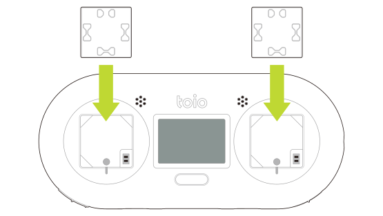

## 充電方法

キューブはコンソールの充電台に乗せることで充電できます。詳しい説明やキューブの電池残量の確認方法については [toio 使いかたガイド](https://support.toio.io/app/manual)をご覧ください。

## 電源の入れ方・切り方

キューブの底面に電源ボタンがあります。電源ボタンを押すとキューブの電源が入ります。
また、電源ボタンを長押しすると電源を切ることができます。

## *オートパワーオフ機能*

キューブとの通信は Bluetooth Low Energy (BLE) で行いますが、キューブが BLE で他のデバイスと未接続な状態が 15 分間続くと自動的に電源が切れます。また、BLE 未接続な状態の間は 3 分おきに報知音が鳴ります。

キューブとの通信に関しては[通信概要 / キューブとの通信について](ble_communication_overview.md#キューブとの通信について)をご覧ください。

## システム状態

キューブのシステム状態に関して、ランプの色と音で通知します。条件は以下のとおりです。

| キューブの状態 | ランプ                                         | 音       |
| -------------- | ---------------------------------------------- | -------- |
| 起動           | 赤色・青色・緑色・白色を順に  1 回づつ点滅 | ○ 音あり |
| 接続待ち       | 青色点滅                                       | ☓ 音なし |
| 接続           | 消灯                                           | ○ 音あり |
| 切断           | 消灯                                           | ○ 音あり |
| 終了           | 消灯                                           | ○ 音あり |
