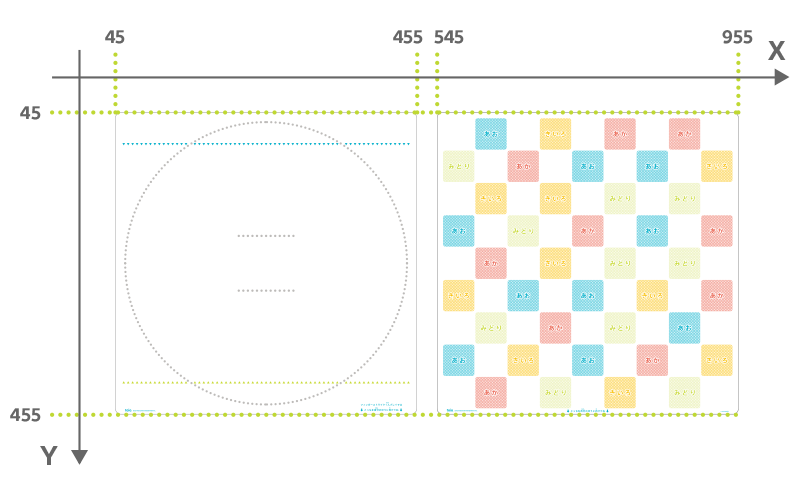
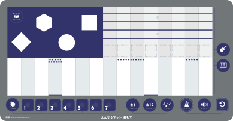
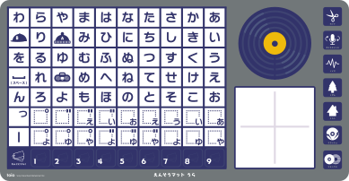
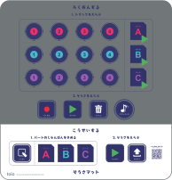

以下に挙げる商品には Position ID が印刷されています。

- [トイオ・コレクション](https://toio.io/titles/toio-collection.html)に付属するプレイマット
- [おんがくであそぼう ピコトンズ](https://toio.io/titles/picotons.html)に付属する「えんそう」マットよび「そうさ／オートプレイ」マット
- [toio コア キューブ（単体）](https://toio.io/cube/)に付属する簡易プレイマット

それぞれの詳細について以下に記載します。また、BLE 経由での情報の読み出し方法については[読み取りセンサー](./id.md)を参照してください。

## トイオ・コレクション付属のプレイマット

|                  | 左上 X 座標 | 左上 Y 座標 | 右下 X 座標 | 右下 Y 座標 |
| ---------------- | ----------- | ----------- | ----------- | ----------- |
| 土俵の面         | 45          | 45          | 455         | 455         |
| 色付きタイルの面 | 545         | 45          | 955         | 455         |

## **「おんがくであそぼう&nbsp;ピコトンズ&trade;」付属のマット**

### えんそうマット（おもて）

| 左上 X 座標 | 左上 Y 座標 | 右下 X 座標 | 右下 Y 座標 |
| ----------- | ----------- | ----------- | ----------- |
| 59          | 2088        | 437         | 2285        |

### えんそうマット（うら）

| 左上 X 座標 | 左上 Y 座標 | 右下 X 座標 | 右下 Y 座標 |
| ----------- | ----------- | ----------- | ----------- |
| 59          | 2303        | 437         | 2499        |

### そうさマット

| 左上 X 座標 | 左上 Y 座標 | 右下 X 座標 | 右下 Y 座標 |
| ----------- | ----------- | ----------- | ----------- |
| 764         | 2093        | 953         | 2290        |

### オートプレイマット

| 左上 X 座標 | 左上 Y 座標 | 右下 X 座標 | 右下 Y 座標 |
| ----------- | ----------- | ----------- | ----------- |
| 554         | 2093        | 742         | 2290        |

## toio コア キューブ（単体）付属の簡易プレイマット

| 左上 X 座標 | 左上 Y 座標 | 右下 X 座標 | 右下 Y 座標 |
| ----------- | ----------- | ----------- | ----------- |
| 98          | 142         | 402         | 358         |
