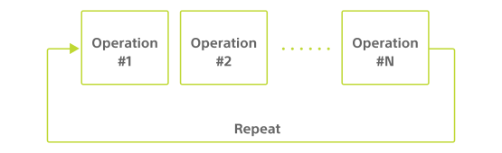

キューブは底面にランプを 1 つ持っています（参考：[各部の名前](hardware_components.md)）。
このランプは以下の特性（characteristic）を使うことで色を指定して点灯や消灯ができます。

| プロパティ          | 値                                   |
| ------------------- | ------------------------------------ |
| Characteristic UUID | 10B20103-5B3B-4571-9508-CF3EFCD7BBAE |
| Properties          | [Write](#書き込み操作)               |
| Descriptor          | Light Control                        |

## 書き込み操作

### 点灯・消灯

以下に示す構成のデータを書き込むことでランプを点灯・消灯できます。
例はランプを赤色で 160 ミリ秒点灯した後に消灯します。

| データ位置 | タイプ | 内容                 | 例                                      |
| ---------- | ------ | -------------------- | --------------------------------------- |
| 0          | UInt8  | 制御の種類           | `0x03`（点灯・消灯） |
| 1          | UInt8  | ランプを制御する時間 | `0x10`（160 ミリ秒）                    |
| 2          | UInt8  | 制御するランプの数   | `0x01`               |
| 3          | UInt8  | 制御するランプの ID  | `0x01`               |
| 4          | UInt8  | ランプの Red の値    | `0xFF`                                  |
| 5          | UInt8  | ランプの Green の値  | `0x00`                                  |
| 6          | UInt8  | ランプの Blue の値   | `0x00`                                  |

#### ランプを制御する時間

ランプを制御する時間を`0`以上`255`以下の範囲で指定します。`0`は「時間制限無し」を意味し、次の書き込み操作が行われるまで点灯・消灯し続けます。`1`以上`255`以下の範囲では x10 ミリ秒点灯・消灯した後に消灯します。

#### 制御するランプの数・制御するランプの ID

制御するランプの数や ID を指定します。制御可能なランプは 1 つのみで、どちらも`1`を指定します。

#### ランプの Red/Green/Blue の値

ランプの色をそれぞれ`0`以上`255`以下の範囲で指定します。全て`0`で指定すると消灯します。

### 連続的な点灯・消灯

以下に示す構成のデータを書き込むことでランプを連続的に点灯・消灯できます。
例はランプを緑色と青色で 300 ミリ秒ごと点滅させつづけます。

| データ位置 | タイプ | 内容                 | 例                                              |
| ---------- | ------ | -------------------- | ----------------------------------------------- |
| 0          | UInt8  | 制御の種類           | `0x04`（連続的な点灯・消灯） |
| 1          | UInt8  | 繰り返し回数         | `0x00`（無限）                                  |
| 2          | UInt8  | Operation の数       | `0x02`（Operation 2 つ）                        |
| 3          | UInt8  | ランプを制御する時間 | `0x1E`（300 ミリ秒）                            |
| 4          | UInt8  | 制御するランプの数   | `0x01`                       |
| 5          | UInt8  | 制御するランプの ID  | `0x01`                       |
| 6          | UInt8  | ランプの Red の値    | `0x00`                                          |
| 7          | UInt8  | ランプの Green の値  | `0xFF`                                          |
| 8          | UInt8  | ランプの Blue の値   | `0x00`                                          |
| 9          | UInt8  | ランプを制御する時間 | `0x1E`（300 ミリ秒）                            |
| 10         | UInt8  | 制御するランプの数   | `0x01`                       |
| 11         | UInt8  | 制御するランプの ID  | `0x01`                       |
| 12         | UInt8  | ランプの Red の値    | `0x00`                                          |
| 13         | UInt8  | ランプの Green の値  | `0x00`                                          |
| 14         | UInt8  | ランプの Blue の値   | `0xFF`                                          |

#### データ構造と Operation

この書き込み操作のデータは以下の図のような長さが可変な構造になっています。

Operation とは[点灯・消灯](#点灯-消灯)で書き込んだ以下の 6 つをまとめたものを表します。

- ランプを制御する時間
- 制御するランプの数
- 制御するランプの ID
- ランプの Red の値
- ランプの Green の値
- ランプの Blue の値

#### 繰り返し回数

Operation の繰り返し回数を`0`以上`255`以下の範囲で指定します。`0`は「無限回」を意味し、次の書き込み操作が行われるまで Operation の繰り返しが終わりません。`1`以上`255`以下の範囲では指定した回数繰り返した後に消灯します。

#### Operation の数

Operation の数を`1`以上`29`以下の範囲で指定します。ここで指定する値が続く Operation の数より小さい場合はここで指定した値の数の Operation だけが繰り返されます。ここで指定する値が続く Operation の数より大きい場合はエラーとなり書き込み操作が破棄されます。

#### ランプを制御する時間

ランプを制御する時間を`1`以上`255`の範囲で指定します。`1`以上`255`以下の範囲では x10 ミリ秒点灯・消灯します。

### 全てのランプを消灯

以下に示す構成のデータを書き込むことで全てのランプを消灯できます。

| データ位置 | タイプ | 内容       | 例                                              |
| ---------- | ------ | ---------- | ----------------------------------------------- |
| 0          | UInt8  | 制御の種類 | `0x01`（全てのランプを消灯） |

### 特定のランプを消灯

以下に示す構成のデータを書き込むことで特定のランプを消灯できます。

| データ位置 | タイプ | 内容                | 例                                              |
| ---------- | ------ | ------------------- | ----------------------------------------------- |
| 0          | UInt8  | 制御の種類          | `0x02`（特定のランプを消灯） |
| 1          | UInt8  | 制御するランプの数  | `0x01`                       |
| 2          | UInt8  | 制御するランプの ID | `0x01`                       |
