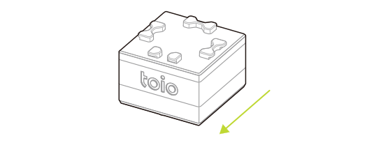
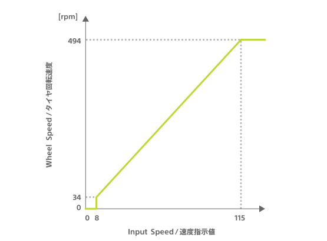
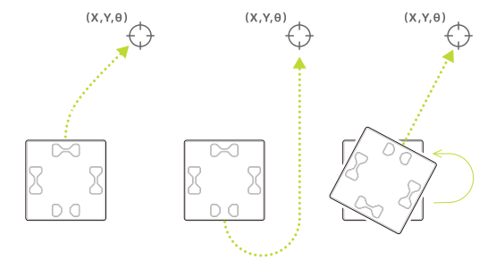

キューブは 2 つのモーターを持ち、それぞれが左右の車輪につながっています（参考：[各部の名前](hardware_components.md)）。
これらのモーターは以下の特性（characteristic）を使うことで制御できます。

| プロパティ          | 値                                                                              |
| ------------------- | ------------------------------------------------------------------------------- |
| Characteristic UUID | 10B20102-5B3B-4571-9508-CF3EFCD7BBAE                                            |
| Properties          | [Write without response](#書き込み操作), [Read](#読み出し操作), [Notify](#通知) |
| Descriptor          | Motor Control                                                                   |

## 書き込み操作

### モーター制御

以下に示す構成のデータを書き込むことでモーターを制御できます。 次の書き込み操作が行われるまで、モーターは指定した速度で動きづづけます。

| データ位置 | タイプ | 内容                  | 例                                        |
| ---------- | ------ | --------------------- | ----------------------------------------- |
| 0          | UInt8  | 制御の種類            | `0x01`（モーター制御） |
| 1          | UInt8  | 制御するモーターの ID | `0x01`（左）                              |
| 2          | UInt8  | モーターの回転方向    | `0x01`（前）                              |
| 3          | UInt8  | モーターの速度指示値  | `0x64`（100）                             |
| 4          | UInt8  | 制御するモーターの ID | `0x02`（右）                              |
| 5          | UInt8  | モーターの回転方向    | `0x02`（後ろ）                            |
| 6          | UInt8  | モーターの速度指示値  | `0x14`（20）                              |

#### 制御するモーターの ID

制御するモーターの ID を指定します。左のモーターの ID が`1`で右のモーターの ID が`2`です。
モーターの ID を指定する場所は 2 箇所ありますが、両方で同じ ID を指定するとエラーになり書き込み操作は無視されます。

#### モーターの回転方向

直前で指定した ID のモーターに対して回転方向を指定します。
キューブの前進する方向が`1`で後退する方向が`2`です。

#### *モーターの速度指示値*

直前で指定した ID のモーターに対して回転の速度を指定します。
モーターの速度指示値は`0`以上`255`以下の範囲で指定できますが、モーターの速度指示値と実際のタイヤの回転速度の関係は以下のグラフのとおりです。

### 時間指定付きモーター制御

以下に示す構成のデータを書き込むことで動かす時間を指定してモーターを制御できます。
指定した時間を経過するとモーターは停止します。

| データ位置 | タイプ | 内容                  | 例                                                    |
| ---------- | ------ | --------------------- | ----------------------------------------------------- |
| 0          | UInt8  | 制御の種類            | `0x02`（時間指定付きモーター制御） |
| 1          | UInt8  | 制御するモーターの ID | `0x01`（左）                                          |
| 2          | UInt8  | モーターの回転方向    | `0x01`（前）                                          |
| 3          | UInt8  | モーターの速度指示値  | `0x64`（100）                                         |
| 4          | UInt8  | 制御するモーターの ID | `0x02`（右）                                          |
| 5          | UInt8  | モーターの回転方向    | `0x02`（後）                                          |
| 6          | UInt8  | モーターの速度指示値  | `0x14`（20）                                          |
| 7          | UInt8  | モーターの制御時間    | `0x0A`（100 ミリ秒）                                  |

#### モーターの制御時間

モーターを動かす時間を`0`以上`255`以下の範囲で指定します。`0`は「時間制限無し」を意味し、次の書き込み操作が行われるまでモーターは指定した速度で動きづづけます。`1`以上`255`以下の範囲では x10 ミリ秒モーターは動いたあと停止します。

### **目標指定付きモーター制御**

目標となる状態を指定してモーターを制御し、キューブを自律的に移動させることができます。設定する目標は以下の構成になっています。

- 目標地点の Position ID の X 座標
- 目標地点の Position ID の Y 座標
- 目標地点でのキューブの角度 Θ

キューブは中心の X 座標、Y 座標および角度が目標に到達するとモーターを停止し、`0x00: 正常終了`の応答を返します。もしくは、タイムアウト等のエラーが発生した場合は対応するエラーの応答を返します。応答については[目標指定付きモーター制御の応答](#目標指定付きモーター制御の応答)を参照してください。

| データ位置 | タイプ | 内容                         | 例                                                    |
| ---------- | ------ | ---------------------------- | ----------------------------------------------------- |
| 0          | UInt8  | 制御の種類                   | `0x03`（目標指定付きモーター制御） |
| 1          | UInt8  | 制御識別値                   | `0x00`                                                |
| 2          | UInt8  | タイムアウト時間             | `0x05`（5 秒）                                        |
| 3          | UInt8  | 移動タイプ                   | `0x00`（回転しながら移動）                            |
| 4          | UInt8  | モーターの最大速度指示値     | `0x50`（80）                                          |
| 5          | UInt8  | モーターの速度変化タイプ     | `0x00`（速度一定）                                    |
| 6          | UInt8  | Reserved                     | `0x00`                             |
| 7          | UInt16 | 目標地点の X 座標値          | `0x02bc`（700）                                       |
| 9          | UInt16 | 目標地点の Y 座標値          | `0x0182`（386）                                       |
| 11         | UInt16 | 目標地点でのキューブの角度 Θ | `0x005a`（90 度）                                     |

#### 制御識別値

対応する[目標指定付きモーター制御の応答](#目標指定付きモーター制御の応答)を識別するための値です。ここで設定した値が対応する応答にも含まれます。これによって連続して書き込み操作をするときに対応する応答を識別できます。値の範囲は`0`以上`255`以下の範囲で自由に設定できます。

#### タイムアウト時間

ここで設定した時間が経過してもキューブが目標地点に到達していない場合、キューブは動作を停止し`0x01: タイムアウト`の応答を返します。
値は`0`以上`255`以下の範囲で指定します。単位は秒です。`0`のみ例外的に 10 秒になります。タイムアウト無しの設定はできません。

#### 移動タイプ

目標地点までのキューブの移動方法を以下の 3 つのタイプから 1 つ選択します。移動せずその場で回転する場合はどれを選んでも同じ動きになります。

| 値  | 移動方法の説明               |
| --- | ---------------------------- |
| `0` | 回転しながら移動             |
| `1` | 回転しながら移動（後退なし） |
| `2` | 回転してから移動             |

移動タイプ毎の動き方: 左から<code>0</code>, <code>1</code>, <code>2</code>

#### モーターの最大速度指示値

キューブが動作可能な最大の速度指示値を指定します。キューブは指定された以上の速度は出さずに動きます。
値の範囲やタイヤの回転速度との関係は[モーターの速度指示値](#モーターの速度指示値)と同じです。
ただし`8`未満（タイヤ回転速度 0 の範囲）を指定した場合、命令は破棄され`0x06: 非サポート`の応答を返します。

#### モーターの速度変化タイプ

目標地点までのキューブの移動速度の変化を以下の 4 つのタイプから 1 つ選択します。

| 値     | 速度変化タイプ                                     |
| ------ | -------------------------------------------------- |
| `0x00` | 速度一定                                           |
| `0x01` | 目標地点まで徐々に加速                             |
| `0x02` | 目標地点まで徐々に減速                             |
| `0x03` | 中間地点まで徐々に加速し、そこから目標地点まで減速 |

#### 目標地点の X 座標・ Y 座標

目標地点の X 座標と Y 座標を指定します。値の範囲はどちらも`0x0000`以上`0xffff`以下で、`0xffff`のみ「書き込み操作時と同じ」という意味になります。Position ID の印刷と座標の関係については、[読み取りセンサー / Position ID / 座標（X 座標、Y 座標）](id.md#座標-x-座標-y-座標)を参照してください。

#### 目標地点でのキューブの角度 Θ

キューブは目標の X 座標・Y 座標に到達した後、ここで設定した角度を目標として回転します。値は 16bit のうち下位 13bit は`0x0000`以上`0x1ffff`以下の範囲で角度を指定します。また上位 3bit は以下のいずれかを指定します。これによって下位 13bit の表す角度の意味と動き方が変わります。

| 上位 3bit の値 | 角度の意味           | 回転方向           |
| -------------- | -------------------- | ------------------ |
| `0x00`         | 絶対角度             | 回転量が少ない方向 |
| `0x01`         | 絶対角度             | 正方向             |
| `0x02`         | 絶対角度             | 負方向             |
| `0x03`         | 相対角度             | 正方向             |
| `0x04`         | 相対角度             | 負方向             |
| `0x05`         | 角度指定なし         | 回転しない         |
| `0x06`         | 書き込み操作時と同じ | 回転量が少ない方向 |

「絶対角度」の場合、角度は Position ID の上での向きそのものを意味します。また「相対角度」の場合、角度はキューブが目標地点に到着したときの状態を基準とした相対的ものを意味します。`0x05: 角度指定なし`の場合は下位 13bit の情報は無視され、目標地点の X 座標・Y 座標に到達したら回転せずモーター制御を終了します。`0x06: 書き込み操作と同じ`の場合は下位 13bit の情報は無視され、書き込み操作と同じ向きになるように回転します。

Position ID 上での角度や回転方向については[読み取りセンサー / Position ID / 角度](id.md#角度)を参照してください。

### **複数目標指定付きモーター制御**

[目標指定付きモーター制御](#目標指定付きモーター制御)を拡張して、複数の目標を指定してモーターを制御できます。例では 3 つの目標を順にたどります。キューブは最後の目標に到達するとモーターを停止し、`0x00: 正常終了`の応答を返します。もしくは、タイムアウト等のエラーが発生した場合は対応するエラーの応答を返します。応答については[複数目標指定付きモーター制御の応答](#複数目標指定付きモーター制御の応答)を参照してください。

| データ位置 | タイプ | 内容                            | 例                                                        |
| ---------- | ------ | ------------------------------- | --------------------------------------------------------- |
| 0          | UInt8  | 制御の種類                      | `0x04`（複数目標指定付きモーター制御） |
| 1          | UInt8  | 制御識別値                      | `0x00`                                                    |
| 2          | UInt8  | タイムアウト時間                | `0x05`（5 秒）                                            |
| 3          | UInt8  | 移動タイプ                      | `0x00`（回転しながら移動）                                |
| 4          | UInt8  | モーターの最大速度指示値        | `0x50`（80）                                              |
| 5          | UInt8  | モーターの速度変化タイプ        | `0x00`（速度一定）                                        |
| 6          | UInt8  | Reserved                        | `0x00`                                 |
| 7          | UInt8  | 書き込み操作の追加設定          | `0x01`（追加）                                            |
| 8          | UInt16 | 目標地点 1 の X 座標値          | `0x0064`（100）                                           |
| 10         | UInt16 | 目標地点 1 の Y 座標値          | `0x0064`（100）                                           |
| 12         | UInt16 | 目標地点 1 でのキューブの角度 Θ | `0x0000`（0 度）                                          |
| 14         | UInt16 | 目標地点 2 の X 座標値          | `0x00c8`（200）                                           |
| 16         | UInt16 | 目標地点 2 の Y 座標値          | `0x0064`（100）                                           |
| 18         | UInt16 | 目標地点 2 でのキューブの角度 Θ | `0x005f`（90 度）                                         |
| 20         | UInt16 | 目標地点 3 の X 座標値          | `0x00c8`（200）                                           |
| 22         | UInt16 | 目標地点 3 の Y 座標値          | `0x00c8`（200）                                           |
| 24         | UInt16 | 目標地点 3 でのキューブの角度 Θ | `0x00b4`（180 度）                                        |

#### データ構造

この書き込み操作のデータは指定する目標の数によって長さが可変な構造になっています。上記の例のようにデータの後ろに目標の情報を「X 座標」「Y 座標」「キューブの角度」の順に並べることで、最大で 29 個の目標を指定できます。目標の情報がない場合、または 29 個を超える場合はエラーとなり、書き込み操作は破棄されます。目標が多くなるにつれてデータサイズも大きくなります。データサイズの大きさによっては BLE の帯域の制約を受けて遅延することがあるのでご注意ください。

#### 制御識別値

対応する[複数目標指定付きモーター制御の応答](#複数目標指定付きモーター制御の応答)を識別するための値です。ここで設定した値が対応する応答にも含まれます。これによって連続して書き込み操作をするときに対応する応答を識別できます。値の範囲は`0`以上`255`以下の範囲で自由に設定できます。

#### タイムアウト時間

ここで設定した時間が経過してもキューブが目標地点に到達していない場合、キューブは動作を停止し`0x01: タイムアウト`の応答を返します。以降の目標への移動は行いません。1 つの目標に到達するとタイマーはリセットされ、次の目標までのタイムアウトを計算を始めます。値は`0`以上`255`以下の範囲で指定します。単位は秒です。`0`のみ例外的に 10 秒になります。タイムアウト無しの設定はできません。

#### 移動タイプ・モーターの最大速度指示値

これらに関しては[目標指定付きモーター制御](#目標指定付きモーター制御)と同じです。

#### モーターの速度変化タイプ

設定する値の範囲や意味は[目標指定付きモーター制御](#目標指定付きモーター制御)と同じですが、全ての目標を通る経路に対して適用されます。

#### 書き込み操作の追加設定

書き込み操作を追加した場合の動作を設定する値です。`0x00: 上書き`と`0x01: 追加`のどちらかを指定します。

通常、モーター制御を実行中に別のモーター制御の書き込み操作をすると実行中の制御を上書き（中断・破棄）し、新たに書き込んだ制御の実行を始めます。`0x00: 上書き`を指定するとこの動作になります。

一方、`0x01: 追加`を指定した場合は以下の 2 つの条件を満たす場合に限り**1 回分**の書き込み操作を保留しておき、実行中のモーター制御が完了した後に自動的に実行を開始できます。

- 実行中のモーター制御が**複数目標指定付きモーター制御**である
- 既に追加した複数目標指定付きモーター制御が**ない**

`0x01: 追加`を指定しても、実行中のモーター制御が複数目標指定付きモーター制御**でない**場合は`0x00: 上書き`と同じ動作になり、実行中のモーター制御を上書き（中断・破棄）します。また、既に追加した複数目標指定付きモーター制御が存在する場合は書き込み操作が破棄され、[複数目標指定付きモーター制御の応答](#複数目標指定付きモーター制御の応答)において`0x07: 書き込み操作の追加不可`の応答を返します。

#### 目標地点の X 座標・Y 座標

設定する値の範囲や意味は基本的に[目標指定付きモーター制御](#目標指定付きモーター制御)と同じです。ただし、2 つ目以降の目標地点において`0xffff`は「書き込み操作時と同じ」ではなく「1 つ前の目標地点での設定と同じ」になります。

#### 目標地点でのキューブの角度 Θ

設定する値の範囲や意味は基本的に[目標指定付きモーター制御](#目標指定付きモーター制御)と同じです。ただし、2 つ目以降の目標地点において上位 3bit の`0x06`は「書き込み操作時と同じ」ではなく「1 つ前の目標地点での設定と同じ」になります。

### **加速度指定付きモーター制御**

以下に示す構成のデータを書き込むことでキューブの加速度を指定してモーターを制御できます。また、モーターそれぞれの速度を指定するのではなくキューブとしての並進速度や回転速度を指定して制御できます。例ではゆっくり弧を描きながら 1 秒間移動します。

| データ位置 | タイプ | 内容                     | 例                                                      |
| ---------- | ------ | ------------------------ | ------------------------------------------------------- |
| 0          | UInt8  | 制御の種類               | `0x05`（加速度指定付きモーター制御） |
| 1          | UInt8  | キューブの並進速度       | `0x32`（50）                                            |
| 2          | UInt8  | キューブの加速度         | `0x05`（5）                                             |
| 3          | UInt16 | キューブの向きの回転速度 | `0x000F`（15 度/秒）                                    |
| 5          | UInt8  | キューブの向きの回転方向 | `0x00`（正方向）                                        |
| 6          | UInt8  | キューブの進行方向       | `0x00`（前進）                                          |
| 7          | UInt8  | 優先指定                 | `0x00`（並進速度優先）                                  |
| 8          | UInt8  | 制御時間                 | `0x64`（1 秒）                                          |

#### キューブの並進速度

キューブが進行方向に対して進む速度を指定します。値の範囲やタイヤの回転速度との関係は[モーターの速度指示値](#モーターの速度指示値)と同じです。

#### キューブの加速度

100 ミリ秒ごとの速度の増加分（または減少分）を指定します。キューブの速度が「キューブの並進速度」で指定した速度に到達すると加速を終了します。値は`0`以上`255`以下の範囲で指定でき、`0`の場合は書き込み操作をすると直ちに「キューブの並進速度」で指定した速度になります。また、この設定は加速度指定付きモーター制御を連続して書き込む場合のみ有効です。キューブがその他のモーター制御で動いている場合は無視され、`0`を設定したときと同様に書き込み操作をすると直ちに「キューブの並進速度」で指定した速度になります。

#### キューブの向きの回転速度

キューブの向きの回転速度を指定します。値は`0x00`以上`0xffff`以下の範囲で指定でき、単位は\[度/秒\]です。

#### キューブの向きの回転方向

キューブの向きの回転方向を指定します。`0`が正方向で`1`が負方向です。Position ID 上での角度や回転方向については[読み取りセンサー / Position ID / 角度](id.md#角度)を参照してください。

#### キューブの進行方向

キューブの進行方向を指定します。`0`が前進する方向で`1`が後退する方向です。

#### 優先指定

並進速度と回転速度の組み合わせによって、モーターに指定できる速度指示値の範囲を超えてしまうことがあります。その場合に並進速度と回転速度のどちらを優先するかを指定します。`0`は並進速度を優先し、回転速度を調整します。`1`は回転速度を優先し、並進速度を調整します。

#### 制御時間

モーターを動かす時間を`0`以上`255`以下の範囲で指定します。`0`は「時間制限無し」を意味し、次の書き込み操作が行われるまでモーターは指定した速度で動きづづけます。`1`以上`255`以下の範囲では x10 ミリ秒モーターは動いたあと停止します。

## 読み出し操作 / 通知

この特性は BLE セントラルに情報を通知します。通知される情報は読み出し操作でも取得可能で、以下のようにデータの先頭の値で内容を判別できます。

| 先頭データ | 情報                                                                      |
| ---------- | ------------------------------------------------------------------------- |
| `0x83`     | [目標指定付きモーター制御の応答](#目標指定付きモーター制御の応答)         |
| `0x84`     | [複数目標指定付きモーター制御の応答](#複数目標指定付きモーター制御の応答) |

### **目標指定付きモーター制御の応答**

[目標指定付きモーター制御](#目標指定付きモーター制御)が書き込まれた後、必ず 1 回だけ以下に示す構成のデータが応答として通知されます。

| データ位置 | タイプ | 内容       | 例                                                          |
| ---------- | ------ | ---------- | ----------------------------------------------------------- |
| 0          | UInt8  | 制御の種類 | `0x83`（目標指定付きモーター制御の応答） |
| 1          | UInt8  | 制御識別値 | `0x00`                                                      |
| 2          | UInt8  | 応答内容   | `0x00`（正常終了）                                          |

#### 制御識別値

対応する[目標指定付きモーター制御](#目標指定付きモーター制御)で設定した値です。

#### 応答内容

応答内容は書き込んだデータ内容や実行結果に応じて以下のいずれかになります。

| 値     | 内容                           | 状態                                                                                                                                        |
| ------ | ------------------------------ | ------------------------------------------------------------------------------------------------------------------------------------------- |
| `0x00` | 正常終了                       | 目標に到達したとき。 モーターは停止する。                                                                                               |
| `0x01` | タイムアウト                   | 指定したタイムアウト時間を経過したとき。 モーターは停止する。                                                                           |
| `0x02` | toio ID missed                 | toio ID がない場所にキューブが置かれたとき。 モーターは停止する。                                                                       |
| `0x03` | 不正なパラメーターの組み合わせ | 座標 X, 座標 Y, 角度の全てが`現在と同じ`だったとき。 書き込み操作は破棄される。                                                         |
| `0x04` | 不正な状態                     | 電源を切られたとき。 応答が通知された後、電源が切れる。                                                                                 |
| `0x05` | 他の書き込み受付               | 目標指定付きモーター制御以外のモーター制御が書き込まれた時。 実行中のモーター制御は終了し、新たに書き込まれたモーター制御が実行される。 |
| `0x06` | 非サポート                     | 指定したモーターの最大速度指示値が`8`未満のとき。 書き込み操作は破棄される。                                                            |

### **複数目標指定付きモーター制御の応答**

[複数目標指定付きモーター制御](#複数目標指定付きモーター制御)が書き込まれた後、必ず 1 回だけ以下に示す構成のデータが応答として通知されます。

| データ位置 | タイプ | 内容       | 例                                                              |
| ---------- | ------ | ---------- | --------------------------------------------------------------- |
| 0          | UInt8  | 制御の種類 | `0x84`（複数目標指定付きモーター制御の応答） |
| 1          | UInt8  | 制御識別値 | `0x00`                                                          |
| 2          | UInt8  | 応答内容   | `0x00`（正常終了）                                              |

#### 制御識別値

対応する[複数目標指定付きモーター制御](#複数目標指定付きモーター制御)で設定した値です。

#### 応答内容

応答内容は書き込んだデータ内容や実行結果に応じて以下のいずれかになります。

| 値     | 内容                           | 状態                                                                                                                                            |
| ------ | ------------------------------ | ----------------------------------------------------------------------------------------------------------------------------------------------- |
| `0x00` | 正常終了                       | 目標に到達したとき。 モーターは停止する。                                                                                                   |
| `0x01` | タイムアウト                   | 指定したタイムアウト時間を経過したとき。 モーターは停止する。                                                                               |
| `0x02` | toio ID missed                 | toio ID がない場所にキューブが置かれたとき。 モーターは停止する。                                                                           |
| `0x03` | 不正なパラメーターの組み合わせ | 座標 X, 座標 Y, 角度の全てが`現在と同じ`だったとき。 書き込み操作は破棄される。                                                             |
| `0x04` | 不正な状態                     | 電源を切られたとき。 応答が通知された後、電源が切れる。                                                                                     |
| `0x05` | 他の書き込み受付               | 複数目標指定付きモーター制御以外のモーター制御が書き込まれた時。 実行中のモーター制御は終了し、新たに書き込まれたモーター制御が実行される。 |
| `0x06` | 非サポート                     | 指定したモーターの最大速度指示値が`8`未満のとき。 書き込み操作は破棄される。                                                                |
| `0x07` | 書き込み操作の追加不可         | 書き込み操作の追加ができないとき 書き込み操作は破棄される。                                                                                 |
