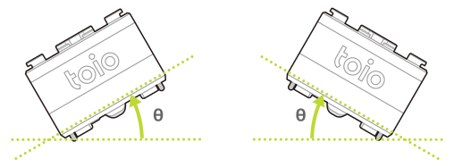
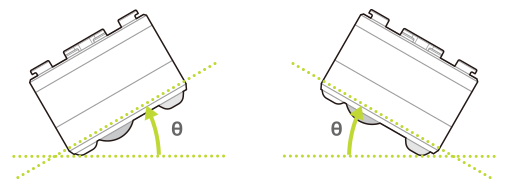

The cube's information, such as communication specification version numbers and configuration information, is stored on the cube.
This information can be obtained and modified using the following characteristic.

| Property            | Value                                                                          |
| ------------------- | ------------------------------------------------------------------------------ |
| Characteristic UUID | 10B201FF-5B3B-4571-9508-CF3EFCD7BBAE                                           |
| Properties          | [Write](#write-operations), [Read](#read-operations), [Notify](#notifications) |
| Descriptor          | Configuration                                                                  |

## Write operations

:::note

While the different setting values can be changed depending on the write operation used, if connection to the cube is interrupted, all changes are discarded and the cube is returned to default values.

:::

### Requesting the BLE protocol version

The BLE protocol version of the cube can be requested by writing the following data. See [Obtaining the BLE protocol version](#obtaining-the-ble-protocol-version) for how to obtain the response.

| Data location | Type  | Content            | Example                                                          |
| ------------- | ----- | ------------------ | ---------------------------------------------------------------- |
| 0             | UInt8 | Configuration type | `0x01` (BLE protocol version request) |
| 1             | UInt8 | Reserved           | `0x00`                                                           |

### Horizontal detection threshold settings

Horizontal detection value obtained through the [Motion detection](sensor.md) becomes `0x00` (not horizontal) if the angle between the bottom of the cube and the horizontal plane (θ in the figure below) exceeds the threshold. This threshold can be changed by writing the following data.

| Data location | Type  | Content            | Example                                                                     |
| ------------- | ----- | ------------------ | --------------------------------------------------------------------------- |
| 0             | UInt8 | Configuration type | `0x05` (Horizontal detection threshold settings) |
| 1             | UInt8 | Reserved           | `0x00`                                                                      |
| 2             | UInt8 | Threshold          | `0x0A` (10 degrees)                                                         |

The threshold apply to both the roll and pitch orientation of rotation. The threshold range and default value are as follows

**Roll orientation**

**Pitch orientation**

| Property  | Range                | Default value  |
| --------- | -------------------- | -------------- |
| Threshold | `1` - `45` (degrees) | `45` (degrees) |

### Collision detection threshold settings

Collision detection value obtained through the [Motion detection](sensor.md) becomes `0x01` (collision) if the force of the collision applied to the cube exceeds the threshold. This threshold can be changed by writing the following data.

| Data location | Type  | Content            | Example                                                                    |
| ------------- | ----- | ------------------ | -------------------------------------------------------------------------- |
| 0             | UInt8 | Configuration type | `0x06` (Collision detection threshold settings) |
| 1             | UInt8 | Reserved           | `0x00`                                                                     |
| 2             | UInt8 | Threshold          | `0x0A` (Level 10)                                                          |

The threshold range and default value are as follows. These values represent the magnitude of the collision.

| Property  | Range              | Default value |
| --------- | ------------------ | ------------- |
| Threshold | `1` - `10` (Level) | `7` (Level)   |

### Double-tap detection time interval settings

Double-tap detection obtained through the [Motion detection](sensor.md) becomes `1` (with double-tap) if the cube is tapped once and then tapped again within the specified time interval. The time interval between the two taps can be changed by writing the following data.

| Data location | Type  | Content            | Example                                                                         |
| ------------- | ----- | ------------------ | ------------------------------------------------------------------------------- |
| 0             | UInt8 | Configuration type | `0x17` (Double-tap detection time interval settings) |
| 1             | UInt8 | Reserved           | `0x00`                                                                          |
| 2             | UInt8 | Time interval      | `0x07` (Level 7)                                                                |

The threshold range and default value for the time interval are as follows. The larger the value, the longer the time interval will be.

| Property      | Range             | Default value |
| ------------- | ----------------- | ------------- |
| Time interval | `0` - `7` (Level) | `5` (Level)   |

### Identification sensor ID notification settings

Set the notification frequency for the [Position ID](id.md#position-id) and [Standard ID](id.md#standard-id) from the identification sensor. **Notifications are sent when both the [Minimum Notification Interval] and [Notification Conditions] are met**. See [Responses to identification sensor ID notification settings](#responses-to-identification-sensor-id-notification-settings) for how to obtain the response.

| Data location | Type  | Content                       | Example                                                                            |
| ------------- | ----- | ----------------------------- | ---------------------------------------------------------------------------------- |
| 0             | UInt8 | Configuration type            | `0x18` (Identification sensor ID notification settings) |
| 1             | UInt8 | Reserved                      | `0x00`                                                                             |
| 2             | UInt8 | Minimum notification interval | `0x01` (10 msec)                                                                   |
| 3             | UInt8 | Notification condition        | `0x01` (Notifications for changes only)                                            |

#### Minimum notification interval

Sets the minimum interval between notifications. The range and default value are as follows. This is set in multiples of 10 milliseconds intervals. For example, setting `5` will send notifications at intervals of 50 milliseconds or longer. This is only the minimum value for the notification interval, and does not guarantee constant intervals between notifications. Please note that the notification interval may vary depending on the status of the central unit.

| Property                      | Range       | Default value         |
| ----------------------------- | ----------- | --------------------- |
| Minimum notification interval | `0` - `255` | `1` (10 milliseconds) |

#### Notification conditions

Select one of the following three types of conditions for notifications to be sent. The default value is `0xff`.

| Notification condition | Content                                                                                                                                    |
| ---------------------- | ------------------------------------------------------------------------------------------------------------------------------------------ |
| `0x00`                 | Notifications are sent even if there is no change in the notification content.                                                             |
| `0x01`                 | Notifications are sent when there is a change of 2 or more coordinates and 3 or more degrees in angle.                                     |
| `0xff`                 | Notifications are stopped for 300 milliseconds if there is no change in coordinates or angle, otherwise notifications continue to be sent. |

### Identification sensor ID missed notification settings

Set the [Position ID missed](id.md#position-id-missed) and [Standard ID missed](id.md#standard-id-missed) notification sensitivity of the identification sensor. See [Responses to identification sensor ID missed notification settings](#responses-to-identification-sensor-id-missed-notification-settings) for how to obtain setting results.

| Data location | Type  | Content                  | Example                                                                                   |
| ------------- | ----- | ------------------------ | ----------------------------------------------------------------------------------------- |
| 0             | UInt8 | Configuration type       | `0x19` (Identification sensor ID missed notification settings) |
| 1             | UInt8 | Reserved                 | `0x00`                                                                                    |
| 2             | UInt8 | Notification sensitivity | `0x0A` (100ms)                                                                            |

#### Notification sensitivity

Set the notification sensitivity when the cube is removed from the top of something on which a Position ID or Standard ID is printed. The range and default value are as follows. This is set in multiples of 10 millisecond intervals. For example, if `5`, is set, "missed" notifications are sent when the cube is removed from the mat or card for 50 milliseconds or longer. If the cube is put back on the mat or card within 50 milliseconds after it is removed, no notifications are sent.

| Property                 | Range       | Default value         |
| ------------------------ | ----------- | --------------------- |
| Notification sensitivity | `0` - `255` | `7` (70 milliseconds) |

### Magnetic sensor settings 

Write the following data to enable or disable the [Magnetic sensor](magnetic_sensor.md) function. This function is disabled by default. See [Responses to magnetic sensor settings](#responses-to-magnetic-sensor-settings) for how to obtain setting results.

| Data location | Type  | Content                | Example                                                               |
| ------------- | ----- | ---------------------- | --------------------------------------------------------------------- |
| 0             | UInt8 | Configuration type     | `0x1b` (Magnetic sensor function settings) |
| 1             | UInt8 | Reserved               | `0x00`                                                                |
| 2             | UInt8 | Function settings      | `0x01` (Activation of magnet state detection)                         |
| 3             | UInt8 | Notification interval  | `0x01` (20 milliseconds)                                              |
| 4             | UInt8 | Notification condition | `0x01` (Notifications for changes only)                               |

The setting values are as follows.
Magnet status detection and magnetic force detection cannot be enabled at the same time.

| Function Setting | Definition                      |
| ---------------- | ------------------------------- |
| `0x00`           | Disable (default value)         |
| `0x01`           | Enable magnet state detection   |
| `0x02`           | Enable magnetic force detection |

#### Notification interval 

Sets the interval for notifications. This is set in multiples of 20 milliseconds. If `0` is set, notifications are disabled.
Note that this is set in multiples different from that of the notification interval settings for high-precision position and tilt information.

| Property              | Range                                  |
| --------------------- | -------------------------------------- |
| Notification interval | `0` - `255` (0 disables notifications) |

#### Notification conditions 

Sets the conditions for notifications to be sent. When `0x00` is set, notifications are sent according to the notification interval even if there is no change.
When `0x01` is set, notifications are sent only when there is change in the magnet state. However, even if there are great changes, notifications are not sent at intervals shorter than that of the above notification interval settings.

| Function Setting | Definition                                |
| ---------------- | ----------------------------------------- |
| `0x00`           | Notifications even if there is no change  |
| `0x01`           | Notifications only when there are changes |

### Motor speed information acquisition settings

Enable or disable [Motor - Obtaining motor speed information](motor.md#obtaining-motor-speed-information) by writing the following data. Motor speed information acquisition is disabled by default. See [Responses to motor speed information acquisition settings](#responses-to-motor-speed-information-acquisition-settings) for how to obtain setting results.

| Data location | Type  | Content            | Example                                                                          |
| ------------- | ----- | ------------------ | -------------------------------------------------------------------------------- |
| 0             | UInt8 | Configuration type | `0x1c` (Motor speed information acquisition settings) |
| 1             | UInt8 | Reserved           | `0x00`                                                                           |
| 2             | UInt8 | Setting value      | `0x01` (Enable)                                                                  |

The setting values are as follows

| Setting value | Meaning                  |
| ------------- | ------------------------ |
| `0x00`        | Disabled (default value) |
| `0x01`        | Enabled                  |

### Posture angle detection settings 

Write the following data to enable or disable the [Posture Angle detection](high_precision_tilt_sensor.md) function. The posture angle detection function is disabled by default. See [Responses to posture angle detection settings](#responses-to-posture-angle-detection-settings) for how to obtain setting results.

| Data location | Type  | Content                      | Example                                                              |
| ------------- | ----- | ---------------------------- | -------------------------------------------------------------------- |
| 0             | UInt8 | Configuration type           | `0x1d` (Posture angle detection settings) |
| 1             | UInt8 | Reserved                     | `0x00`                                                               |
| 2             | UInt8 | Type of notification content | `0x01` (Euler angle)                                                 |
| 3             | UInt8 | Notification interval        | `0x01` (10 milliseconds)                                             |
| 4             | UInt8 | Notification condition       | `0x01` (Notifications only where there are changes)                  |

The types of notifications are as follows.

| Type of notifications | Definition                    |
| --------------------- | ----------------------------- |
| `0x01`                | Notifications in Euler angles |
| `0x02`                | Notifications in quaternions  |

#### Notification interval

Sets the interval for notifications. This is set in multiples of 10 milliseconds. If `0` is set, notifications are disabled.
Note that this is set in multiples different from that of the magnetic sensor notification interval settings.

| Property              | Range                                  |
| --------------------- | -------------------------------------- |
| Notification interval | `0` - `255` (0 disables notifications) |

#### Notification conditions

Sets the conditions for notifications to be sent. If `0x00` is set, notifications are sent according to the notification interval even if there is no change.
When `0x01` is set, notifications are sent only when there is change in the tilt status. However, even if there are great changes, notifications are not sent at intervals shorter than that of the above notification interval settings.

| Function Setting | Definition                                |
| ---------------- | ----------------------------------------- |
| `0x00`           | Notifications even if there is no change  |
| `0x01`           | Notifications only when there is a change |

## Read operations

### Obtaining the BLE protocol version

See [Requesting the BLE protocol version](#requesting-the-ble-protocol-version) for the request method.

| Data location | Type   | Contents                             | Example                                                                |
| ------------- | ------ | ------------------------------------ | ---------------------------------------------------------------------- |
| 0             | UInt8  | Configuration type                   | `0x81` (Obtaining the BLE protocol version) |
| 1             | UInt8  | Reserved                             | `0x00`                                                                 |
| 2             | String | BLE protocol version (5 bytes utf-8) | &nbsp;                                                                 |

### Responses to identification sensor ID notification settings

If [Identification sensor ID notification settings](#identification-sensor-id-notification-settings) is written, the following responses are obtained depending on the results of the identification sensor ID notification settings.

| Data location | Type  | Content            | Example                                                                                         |
| ------------- | ----- | ------------------ | ----------------------------------------------------------------------------------------------- |
| 0             | UInt8 | Configuration type | `0x98` (Responses to identification sensor ID notification settings) |
| 1             | UInt8 | Reserved           | `0x00`                                                                                          |
| 2             | UInt8 | Resulting value    | `0x00` (Set successfully)                                                                       |

The definitions of the result values are as follows.

| Result value            | Definition          |
| ----------------------- | ------------------- |
| `0x00`                  | OK/Set successfully |
| Value other than `0x00` | NG/Setting failed   |

### Responses to identification sensor ID missed notification settings

If [Identification sensor ID missed notification settings](#identification-sensor-id-missed-notification-settings) is written, the following responses are obtained depending on the results of the identification sensor missed ID notification settings.

| Data location | Type  | Content            | Example                                                                                                |
| ------------- | ----- | ------------------ | ------------------------------------------------------------------------------------------------------ |
| 0             | UInt8 | Configuration type | `0x99` (Responses to identification sensor missed ID notification settings) |
| 1             | UInt8 | Reserved           | `0x00`                                                                                                 |
| 2             | UInt8 | Resulting value    | `0x00` (Set successfully)                                                                              |

The definitions of the result values are as follows.

| Result value            | Definition          |
| ----------------------- | ------------------- |
| `0x00`                  | OK/Set successfully |
| Value other than `0x00` | NG/Setting failed   |

### Responses to magnetic sensor settings

If [Magnetic sensor settings](#magnetic-sensor-settings) is written, the following responses are obtained depending on the setting results.

| Data location | Type  | Content            | Example                                                                   |
| ------------- | ----- | ------------------ | ------------------------------------------------------------------------- |
| 0             | UInt8 | Configuration type | `0x9b` (Responses to magnetic sensor settings) |
| 1             | UInt8 | Reserved           | `0x00`                                                                    |
| 2             | UInt8 | Resulting value    | `0x00` (Set successfully)                                                 |

The definitions of the result values are as follows.

| Result value            | Definition          |
| ----------------------- | ------------------- |
| `0x00`                  | OK/Set successfully |
| Value other than `0x00` | NG/Setting failed   |

### Responses to motor speed information acquisition settings

If [Motor speed information acquisition settings](#motor-speed-information-acquisition-settings) is written, the following responses are obtained depending on the result.

| Data location | Type  | Content            | Example                                                                                       |
| ------------- | ----- | ------------------ | --------------------------------------------------------------------------------------------- |
| 0             | UInt8 | Configuration type | `0x9c` (Responses to motor speed information acquisition settings) |
| 1             | UInt8 | Reserved           | `0x00`                                                                                        |
| 2             | UInt8 | Resulting value    | `0x00` (Set successfully)                                                                     |

The definitions of the result values are as follows.

| Result value            | Definition          |
| ----------------------- | ------------------- |
| `0x00`                  | OK/Set successfully |
| Value other than `0x00` | NG/Setting failed   |

### Responses to posture angle detection settings 

If [Posture angle detection settings](#posture-angle-detection-settings) is written, the following responses are obtained depending on the result.

| Data location | Type  | Content            | Example                                                                           |
| ------------- | ----- | ------------------ | --------------------------------------------------------------------------------- |
| 0             | UInt8 | Configuration type | `0x9d` (Responses to posture angle detection settings) |
| 1             | UInt8 | Reserved           | `0x00`                                                                            |
| 2             | UInt8 | Resulting value    | `0x00` (Set successfully)                                                         |

The definitions of the result values are as follows.

| Result value            | Definition          |
| ----------------------- | ------------------- |
| `0x00`                  | OK/Set successfully |
| Value other than `0x00` | NG/Setting failed   |

## Notifications

The data obtained from [Read operations](#read-operations) can also be received through notifications.
