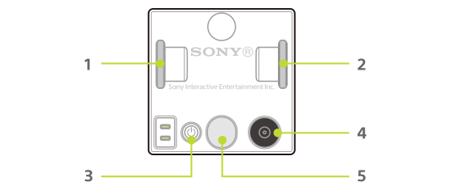

The following are the names of the parts of the cube and the communication specifications for using them.

| Number | Name                      | Corresponding function/communication specification |
| ------ | ------------------------- | -------------------------------------------------- |
| 1      | Wheel (right)             | [Motor](motor.md)                                  |
| 2      | Wheel (left)              | [Motor](motor.md)                                  |
| 3      | Power button              | -                                                  |
| 4      | Identification sensor     | [Identification sensor](id.md)                     |
| 5      | Function button/indicator | [Button](button.md) / [Indicator](light.md)        |
