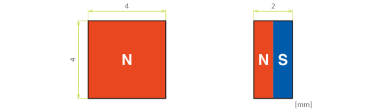
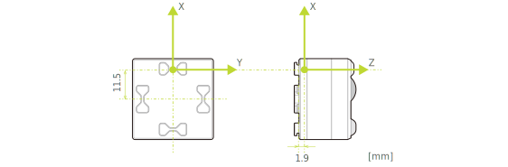

Two functions are available using the cube's 3-axis magnetic sensor: "magnet state detection" and "magnetic force detection".

"Magnet state detection" is available with version v02.0004 (BLE protocol version v2.2.0) of the cube system software.
With version v02.0005 (BLE protocol version v2.3.0) of the cube system software, "Magnetic force detection" is also available.

For information on the system software versions and how to update your software, please see [About - How to update](how_to_update_cube.md).

For the communication specifications, see [Communication specifications - Magnetic sensors](magnetic_sensor.md).

:::caution

- The use of strong magnets may prevent the cube from operating normally or lead to malfunction. Please be careful when using strong magnets around the cube.
- When handling magnets, please read the magnet manufacturer's instruction manual carefully, follow the safety instructions, and have a knowledgeable person handle the magnets responsibly.

:::

## 1. Magnet status detection

Magnets placed in preestablished positions and magnetic force can detect six different conditions.
Because the detection of magnetic flux density is limited to a certain range, these conditions will not be detected correctly once outside of this range. Before using the cube, please be sure to test the magnets on the cube in the actual environment where the cube will be used.

### Magnet specifications

The specifications of the magnets are as follows

| Item                        | Content                            |
| --------------------------- | ---------------------------------- |
| Size                        | 4 x 4 x 2 [mm]                     |
| Material                    | Sintered neodymium magnet N40      |
| Direction of magnetic force | 2mm in the perpendicular direction |

### Magnet layout specifications

The following six conditions can be detected due to the positioning of the magnets and the direction of the magnetic forces.

## 2. Magnetic force detection 

The strength and direction of the magnetic force can be detected.

The strength of the magnetic force is always expressed as a positive value, regardless of the polarity of the magnet.

The direction of the magnetic force is the direction in which the magnetic flux pass through the cube, expressed as a three-dimensional vector with X, Y, and Z components.
The length of this 3D vector remains the same (approximately 10), regardless of the strength of the magnetic force.

The magnetic coordinate system for the cube is shown in the figure below, with the direction of the arrow being the positive direction.

