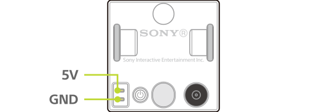

## Speed

The maximum speed for horizontal movement with nothing on the cube is as follows.

| State                | Speed        |
| -------------------- | ------------ |
| Straight line motion | 350 mm/sec   |
| Rotation             | 1500 deg/sec |

## Loading weight

The maximum loading weight is 200 grams. However, even if the weight is less than 200 grams, the cube may not run properly depending on the center of gravity of this weight.

## Battery

| Item             | Value                       |
| ---------------- | --------------------------- |
| Type             | Lithium-ion Polymer Battery |
| Nominal Voltage  | 3.7 V                       |
| Nominal Capacity | 260 mAh                     |

## Charging connector

### Polarity

The longer pin is GND.

### Input voltage / Input current

| Item          | Value  |
| ------------- | ------ |
| Input voltage | DC 5 V |
| Input current | 0.3 A  |

### Compatible receptacle connector

| Item         | Value                           |
| ------------ | ------------------------------- |
| Manufacturer | Foxconn Interconnect Technology |
| Part number  | BBRC2H1-B9603-7H                |
