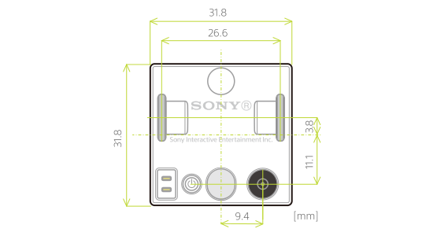

This section introduces the shape and size of the cube. All measurements are in millimeters.

## Protruding shapes for block attachment

The protrusions on the top of the cube can be used to attach standard toy blocks.

## Sides

The following figure indicates the size of the cube body as seen from the side, including when the top plate is attached.

## Bottom

The layout of the parts on the bottom of the cube is indicated in the figure below.

