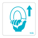

The following products have Standard ID printed on them.

- Various cards and sheets included with the [toio COLLECTION](https://toio.io/titles/toio-collection.html)
- Scan marks included with the [toio COLLECTION Extension Pack](https://toio.io/titles/toio-collection-extension.html)
- Simple card included with the [toio Core Cube (single package)](https://toio.io/cube/)

The details of each are described below. For information on how to scan information using BLE, see [Identification sensor](./id.md)

## Cards and sheets included with the toio COLLECTION

The various items and their corresponding Standard ID values are as follows.

| Name                            | Card/Sticker                                                                                                                        | Value   | Value (hexadecimal) |
| ------------------------------- | ----------------------------------------------------------------------------------------------------------------------------------- | ------- | ------------------- |
| Typhoon                         |                                              | 3670016 | 0x00380000          |
| Rush                            |                                                          | 3670054 | 0x00380026          |
| Auto-Tackle                     |                              | 3670018 | 0x00380002          |
| Random                          |                                                  | 3670056 | 0x00380028          |
| Powered Up Strike               |          | 3670020 | 0x00380004          |
| Powered Up Slap                 |  | 3670058 | 0x0038002a          |
| Side Attack                     |                              | 3670022 | 0x00380006          |
| Easy Mode                       |                      | 3670060 | 0x0038002c          |
| Left                            |                                                                                                   | 3670024 | 0x00380008          |
| Right                           |                                                                                                 | 3670062 | 0x0038002e          |
| Forward                         |                                                                                               | 3670026 | 0x0038000a          |
| Back                            |                                                                                                   | 3670064 | 0x00380030          |
| GO                              |                                                                                                       | 3670028 | 0x0038000c          |
| Skunk (Blue)                    |                                                                                            | 3670078 | 0x0038003e          |
| Skunk (Green)                   |                                                                                          | 3670042 | 0x0038001a          |
| Skunk (Yellow)                  |                                                                                        | 3670080 | 0x00380040          |
| Skunk (Orange)                  |                                                                                        | 3670044 | 0x0038001c          |
| Skunk (Red)                     |                                                                                              | 3670082 | 0x00380042          |
| Skunk (Brown)                   |                                                                                          | 3670046 | 0x0038001e          |
| Speed Up                        |                                                                                          | 3670066 | 0x00380032          |
| Slow Down                       |                                                                                       | 3670030 | 0x0038000e          |
| Wobble                          |                                                                                              | 3670068 | 0x00380034          |
| Panic                           |                                                                                                | 3670032 | 0x00380010          |
| Spin                            |                                                                                                  | 3670070 | 0x00380036          |
| Shock                           |                                                                                                | 3670034 | 0x00380012          |
| Craft Fighter                   |                                                                                   | 3670048 | 0x00380020          |
| Rhythm & Go                     |                                                                                     | 3670052 | 0x00380024          |
| Skunk Chaser                    |                                                                                     | 3670086 | 0x00380046          |
| Finger Strike                   |                                                                                   | 3670050 | 0x00380022          |
| Finger Strike for single player |                                                              | 3670088 | 0x00380048          |
| Free Move                       |                                                                                           | 3670084 | 0x00380044          |

## Scanning marks included with the toio COLLECTION Extension Pack

| Name                   | Scanning mark                                                | Value   | Value (hexadecimal) |
| ---------------------- | ------------------------------------------------------------ | ------- | ------------------- |
| Quick Skunk (2P)       |                 | 3670092 | 0x0038004C          |
| Quick Skunk (CPU)      |               | 3670094 | 0x0038004E          |
| Kaiju Busters          |                     | 3670096 | 0x00380050          |
| Watch Out (free)       |          | 3670098 | 0x00380052          |
| Watch Out (2P)         |              | 3670100 | 0x00380054          |
| Watch Out (CPU)        |            | 3670102 | 0x00380056          |
| Color Memory           |                      | 3670104 | 0x00380058          |
| Laser Beam (challenge) |  | 3670106 | 0x0038005A          |
| Laser Beam (create)    |        | 3670108 | 0x0038005C          |
| Baton                  |                             | 3670110 | 0x0038005E          |
| Pull Back              |                      | 3670112 | 0x00380060          |
| Dash                   |                               | 3670114 | 0x00380062          |
| Don't Disturb (Normal) |       | 3670116 | 0x00380064          |
| Don't Disturb (Rodeo)  |         | 3670118 | 0x00380066          |
| Answer                 |                           | 3670120 | 0x00380068          |
| Music (Song 1)         |                    | 3670122 | 0x0038006A          |
| Music (Song 2)         |                    | 3670124 | 0x0038006C          |
| Music (Song 3)         |                    | 3670126 | 0x0038006E          |
| Music (Song 4)         |                    | 3670128 | 0x00380070          |

## Simple card included with the toio Core Cube (single package)

The marks (numbers, alphabets, and symbols) on the simple card and the corresponding Standard ID values are as follows. Numbers (0 to 9) and letters (A to Z) are listed in order.

| Mark     | Value   | Value (hexadecimal) |
| -------- | ------- | ------------------- |
| 0        | 3670320 | 0x00380130          |
| 1        | 3670321 | 0x00380131          |
| 2        | 3670322 | 0x00380132          |
| 3        | 3670323 | 0x00380133          |
| 4        | 3670324 | 0x00380134          |
| 5        | 3670325 | 0x00380135          |
| 6        | 3670326 | 0x00380136          |
| 7        | 3670327 | 0x00380137          |
| 8        | 3670328 | 0x00380138          |
| 9        | 3670329 | 0x00380139          |
| A        | 3670337 | 0x00380141          |
| B        | 3670338 | 0x00380142          |
| C        | 3670339 | 0x00380143          |
| D        | 3670340 | 0x00380144          |
| E        | 3670341 | 0x00380145          |
| F        | 3670342 | 0x00380146          |
| G        | 3670343 | 0x00380147          |
| H        | 3670344 | 0x00380148          |
| I        | 3670345 | 0x00380149          |
| J        | 3670346 | 0x0038014a          |
| K        | 3670347 | 0x0038014b          |
| L        | 3670348 | 0x0038014c          |
| M        | 3670349 | 0x0038014d          |
| N        | 3670350 | 0x0038014e          |
| O        | 3670351 | 0x0038014f          |
| P        | 3670352 | 0x00380150          |
| Q        | 3670353 | 0x00380151          |
| R        | 3670354 | 0x00380152          |
| S        | 3670355 | 0x00380153          |
| T        | 3670356 | 0x00380154          |
| U        | 3670357 | 0x00380155          |
| V        | 3670358 | 0x00380156          |
| W        | 3670359 | 0x00380157          |
| X        | 3670360 | 0x00380158          |
| Y        | 3670361 | 0x00380159          |
| Z        | 3670362 | 0x0038015a          |
| &excl;   | 3670305 | 0x00380121          |
| &uarr;   | 3670366 | 0x0038015e          |
| &quest;  | 3670335 | 0x0038013f          |
| &plus;   | 3670315 | 0x0038012b          |
| &minus;  | 3670317 | 0x0038012d          |
| &equals; | 3670333 | 0x0038013d          |
| &larr;   | 3670332 | 0x0038013c          |
| &darr;   | 3670367 | 0x0038015f          |
| &rarr;   | 3670334 | 0x0038013e          |
| &times;  | 3670314 | 0x0038012a          |
| &divide; | 3670319 | 0x0038012f          |
| &percnt; | 3670309 | 0x00380125          |
