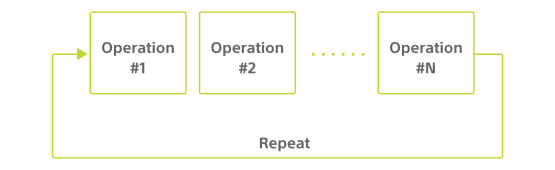

There is one piezoelectric speaker in the cube that plays sound.
This piezoelectric speaker can play sound effects or melodies using MIDI note numbers within the cube using the following characteristic.

| Property            | Value                                |
| ------------------- | ------------------------------------ |
| Characteristic UUID | 10B20104-5B3B-4571-9508-CF3EFCD7BBAE |
| Properties          | [Write](#write-operations)           |
| Descriptor          | Sound Control                        |

## Write operations

### Playing sound effects

Sound effects on the cube can be played by writing the following configuration data.
In the example, the "Mat in" sound effect is played.

| Data location | Type  | Content         | Example                                               |
| ------------- | ----- | --------------- | ----------------------------------------------------- |
| 0             | UInt8 | Control type    | `0x02` (Play sound effect) |
| 1             | UInt8 | Sound effect ID | `0x04` (Mat in)                                       |
| 2             | UInt8 | Volume          | `0xFF` (Max)                                          |

#### Sound effect ID

The sound effect ID is specified with values ranging between `0` and `10`, and the correlation between the ID and the type of sound effect is as follows.

| Sound effect ID | Type of sound effect |
| --------------- | -------------------- |
| 0               | Enter                |
| 1               | Selected             |
| 2               | Cancel               |
| 3               | Cursor               |
| 4               | Mat in               |
| 5               | Mat out              |
| 6               | Get 1                |
| 7               | Get 2                |
| 8               | Get 3                |
| 9               | Effect 1             |
| 10              | Effect 2             |

#### Volume

The volume can be specified with values ranging between `0` and `255`, where `0` is volume 0 (off) and all the other values are the maximum volume.

### Playing the MIDI note numbers

A melody can be played with a MIDI note number by writing the following configuration data. In the example "C5-D5-E5" is played on repeat.

| Data location | Type  | Content               | Example                                                   |
| ------------- | ----- | --------------------- | --------------------------------------------------------- |
| 0             | UInt8 | Control type          | `0x03` (Play MIDI note number) |
| 1             | UInt8 | Number of repetitions | `0x00` (Infinite)                                         |
| 2             | UInt8 | Number of operations  | `0x03` (Three)                                            |
| 3             | UInt8 | Duration played       | `0x1E` (300 milliseconds)                                 |
| 4             | UInt8 | MIDI note number      | `0x3C` (C5)                                               |
| 5             | UInt8 | Volume                | `0x1E` (Max)                                              |
| 6             | UInt8 | Duration played       | `0x1E` (300 milliseconds)                                 |
| 7             | UInt8 | MIDI note number      | `0x3E` (D5)                                               |
| 8             | UInt8 | Volume                | `0xFF` (Max)                                              |
| 9             | UInt8 | Duration played       | `0x1E` (300 milliseconds)                                 |
| 10            | UInt8 | MIDI note number      | `0x40` (E5)                                               |
| 11            | UInt8 | Volume                | `0xFF` (Max)                                              |

#### Data Structure and Operation

The data for this write operation has structure with a variable length as shown in the figure below.

Operation is made up of the following three elements.

- Duration played
- MIDI note number
- Volume

#### Number of iterations

Specifies the number of times Operation is repeated in the range from `0` to `255`. `0` means "infinite times", and Operation repetition will not end until the next write operation is performed. In the range of `1` to `255`, the indicator will turn off after repeating the specified number of times.

#### Number of Operation

Specifies the number of operations with values ranging between `1` and `59`. If the value specified is smaller than the number of operations that follow, only the number of operations specified are repeated. If the value specified is greater than the number of operations that follow, an error occurs and the write operation is discarded.

#### Duration played

Specifies the length of time a MIDI note number is played, with values ranging between `1` and `255`. The MIDI note number is played for 10 times the specified value in milliseconds.

#### MIDI note number

Specifies the MIDI note number that is played, with values ranging between `0` and `128`. See [MIDI note number and note name](#midi-note-number-and-note-name) for the correlation with the note names.

### Stop playing

[Playing sound effects] (#Playing-sound-effects) and [Playing MIDI note number] (#Playing-MIDI-note-number) can be stopped by writing the following configuration data.

| Data location | Type  | Content      | Example                                          |
| ------------- | ----- | ------------ | ------------------------------------------------ |
| 0             | UInt8 | Control type | `0x01` (Stop playing) |

## Additional information

### MIDI note number and note name

The correlation between the MIDI note numbers and note names is as follows: MIDI note number = 57 creates a 440 Hz sound, and MIDI note number = 128 creates no sound.

<table>
  <thead>
    <tr>
      <th colspan="1" rowspan="2">Octave</th>
      <th colspan="12">Note name</th>
    </tr>
    <tr align="middle">
      <th>C</th>
      <th>C#</th>
      <th>D</th>
      <th>D#</th>
      <th>E</th>
      <th>F</th>
      <th>F#</th>
      <th>G</th>
      <th>G#</th>
      <th>A</th>
      <th>A#</th>
      <th>B</th>
    </tr>  
  </thead>
  <tbody>
    <tr align="middle">
      <th>0</th>
      <td>0</td>
      <td>1</td>
      <td>2</td>
      <td>3</td>
      <td>4</td>
      <td>5</td>
      <td>6</td>
      <td>7</td>
      <td>8</td>
      <td>9</td>
      <td>10</td>
      <td>11</td>
    </tr>
    <tr align="middle">
      <th>1</th>
      <td>12</td>
      <td>13</td>
      <td>14</td>
      <td>15</td>
      <td>16</td>
      <td>17</td>
      <td>18</td>
      <td>19</td>
      <td>20</td>
      <td>21</td>
      <td>22</td>
      <td>23</td>
    </tr>
    <tr align="middle">
      <th>2</th>
      <td>24</td>
      <td>25</td>
      <td>26</td>
      <td>27</td>
      <td>28</td>
      <td>29</td>
      <td>30</td>
      <td>31</td>
      <td>32</td>
      <td>33</td>
      <td>34</td>
      <td>35</td>
    </tr>
    <tr align="middle">
      <th>3</th>
      <td>36</td>
      <td>37</td>
      <td>38</td>
      <td>39</td>
      <td>40</td>
      <td>41</td>
      <td>42</td>
      <td>43</td>
      <td>44</td>
      <td>45</td>
      <td>46</td>
      <td>47</td>
    </tr>
    <tr align="middle">
      <th>4</th>
      <td>48</td>
      <td>49</td>
      <td>50</td>
      <td>51</td>
      <td>52</td>
      <td>53</td>
      <td>54</td>
      <td>55</td>
      <td>56</td>
      <td>57</td>
      <td>58</td>
      <td>59</td>
    </tr>
    <tr align="middle">
      <th>5</th>
      <td>60</td>
      <td>61</td>
      <td>62</td>
      <td>63</td>
      <td>64</td>
      <td>65</td>
      <td>66</td>
      <td>67</td>
      <td>68</td>
      <td>69</td>
      <td>70</td>
      <td>71</td>
    </tr>
    <tr align="middle">
      <th>6</th>
      <td>72</td>
      <td>73</td>
      <td>74</td>
      <td>75</td>
      <td>76</td>
      <td>77</td>
      <td>78</td>
      <td>79</td>
      <td>80</td>
      <td>81</td>
      <td>82</td>
      <td>83</td>
    </tr>
    <tr align="middle">
      <th>7</th>
      <td>84</td>
      <td>85</td>
      <td>86</td>
      <td>87</td>
      <td>88</td>
      <td>89</td>
      <td>90</td>
      <td>91</td>
      <td>92</td>
      <td>93</td>
      <td>94</td>
      <td>95</td>
    </tr>
    <tr align="middle">
      <th>8</th>
      <td>96</td>
      <td>97</td>
      <td>98</td>
      <td>99</td>
      <td>100</td>
      <td>101</td>
      <td>102</td>
      <td>103</td>
      <td>104</td>
      <td>105</td>
      <td>106</td>
      <td>107</td>
    </tr>
    <tr align="middle">
      <th>9</th>
      <td>108</td>
      <td>109</td>
      <td>110</td>
      <td>111</td>
      <td>112</td>
      <td>113</td>
      <td>114</td>
      <td>115</td>
      <td>116</td>
      <td>117</td>
      <td>118</td>
      <td>119</td>
    </tr>
    <tr align="middle">
      <th>10</th>
      <td>120</td>
      <td>121</td>
      <td>122</td>
      <td>123</td>
      <td>124</td>
      <td>125</td>
      <td>126</td>
      <td>127</td>
    </tr>
  </tbody>
</table>
