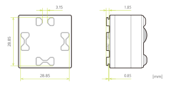
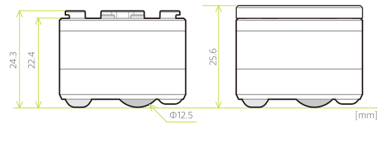

This section introduces the shape and size of the cube. All measurements are in millimeters.

## 3D Model

The 3D model data of the cube is available for download below.

import { ModelDownloadButtonGroup } from '@site/src/components/ModelDownloadButtonGroup'

<ModelDownloadButtonGroup />

import { Cube3DView } from '@site/src/components/Cube3DView'

  <Cube3DView />

:::note

The 3D model data are licensed under the [Creative Commons Attribution-ShareAlike 4.0 International Public License](https://creativecommons.org/licenses/by-nd/4.0/). Please check [here](about.md#license) for details.

:::

## Protruding shapes for block attachment

The protrusions on the top of the cube can be used to attach standard toy blocks.

## Sides

The following figure indicates the size of the cube body as seen from the side, including when the top plate is attached.

## Bottom

The layout of the parts on the bottom of the cube is indicated in the figure below.

