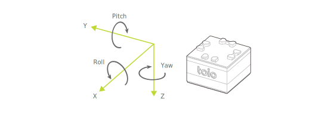

---

id: ble_high_precision_tilt_sensor
title: Posture Angle detection
sidebar_label: 🔄 Posture Angle detection
--- .

Using a posture estimation algorithm, the posture angle (estimated value) is calculated based on the output from the cube's motion sensor (6-axis detection system).
Because this posture angle is not a raw value from the motion sensor but a value calculated in the cube with the acceleration and angular velocity, it always contains a certain amount of error or drift.

:::note

This feature is **disabled** by default. It becomes operational only once enabled in [Configuration - Posture angle detection settings](configuration.md#posture-angle-detection-settings).

:::

Posture angle detection can be obtained using the following characteristics. These characteristics are the same for [Motion Detection](sensor.md) and [Magnetic Sensor](magnetic_sensor.md).

| Property            | Value                                                                                                          |
| ------------------- | -------------------------------------------------------------------------------------------------------------- |
| Characteristic UUID | 10B20106-5B3B-4571-9508-CF3EFCD7BBAE                                                                           |
| Properties          | [Write](#write-operations), [Read](#read-operations--notifications), [Notify](#read-operations--notifications) |
| Descriptor          | Sensor Information                                                                                             |

## Write operations 

### Requesting posture angle detection

Posture angle information can be requested by writing the following data. Once the cube receives a request, it makes a notification on the posture angle once.

| Data location | Type  | Content           | Example                                                                 |
| ------------- | ----- | ----------------- | ----------------------------------------------------------------------- |
| 0             | UInt8 | Information type  | `0x83` (Request for posture angle detection) |
| 1             | UInt8 | Notification type | `0x01` (Notifications in Euler angles)       |

The types of notifications are as follows

| Type of notification content | Definition                                   |
| ---------------------------- | -------------------------------------------- |
| `0x01`                       | Notifications in Euler angles                |
| `0x02`    | Notifications in quaternions                 |
| `0x03`    | Notifications in high precision Euler angles |

## Read operations / Notifications 

When the posture angle of the cube changes, this characteristic notifies the BLE central of this information.
The notified information can also be obtained through read operations.

:::note

This characteristic is the same for [Motion detection](sensor.md) and [Magnetic sensor](magnetic_sensor.md). Since this information is also obtained, please also see [Motion detection - Read operations / Notifications](sensor.md#read-operations--notifications) and [Magnetic sensor - Read operations / Notifications](magnetic_sensor.md#read-operations--notifications) when using this characteristic.

:::

### Obtaining posture angle information (notifications in Euler angles)

The following data can be obtained when the type of notification content is set to Euler angle notifications.

| Data location | Type  | Content           | Example                                                           |
| ------------- | ----- | ----------------- | ----------------------------------------------------------------- |
| 0             | UInt8 | Information type  | `0x03` (Posture angle detection)       |
| 1             | UInt8 | Notification type | `0x01` (Notifications in Euler angles) |
| 2             | Int16 | Roll (X axis)     | `0x00B4` (180 degree)                                             |
| 4             | Int16 | Pitch (Y axis)    | `0x0000` (0 degree)                                               |
| 6             | Int16 | Yaw (Z axis)      | `0xFF4E` (-178 degree)                                            |

#### Angles

Euler angle format is integer.

The angle range is -179°(0xFF4D) to 180°(0x00B4) for roll and yaw, and -90°(0xFFA6) to 90°(0x005A) for pitch.

The rotation order is yaw (Z axis), pitch (Y axis), roll (X axis).
The roll angle and pitch angle are 0° when the cube is placed horizontally on a surface with the wheel side on the bottom. The yaw angle is 0° when the cube is facing the direction it faced when it was turned on.

#### Errors

Because rotation around the Z axis (yaw angle in Euler angles) cannot be corrected with acceleration sensor, errors will accumulate. The following is a concrete example of this effect.

- The yaw angle shifts by about 1° every few seconds even though the cube is not moving.
- The yaw angle shifts by several degrees when the cube rotates by one rotation with the Z axis as the central axis.

### Obtaining posture angle information (notifications in quaternions) 

When the notification content type is set to notifications in quaternions, the following data can be obtained.

| Data location | Type    | Content           | Example                                                          |
| ------------- | ------- | ----------------- | ---------------------------------------------------------------- |
| 0             | UInt8   | Information type  | `0x03` (Posture angle detection)      |
| 1             | UInt8   | Notification type | `0x02` (Notifications in quaternions) |
| 2             | Float32 | w                 | `0x0000803F` (1.0)                                               |
| 4             | Float32 | x                 | `0x00000000` (0.0)                                               |
| 6             | Float32 | y                 | `0x00000000` (0.0)                                               |
| 8             | Float32 | z                 | `0x00000000` (0.0)                                               |

#### Value range

The value range is -1.0 to 1.0.

### Obtaining posture angle information (notifications in high precision Euler angles) 

The following data can be obtained when the type of notification content is set to high precision Euler angle notifications.

| Data location | Type    | Content           | Example                                                           |
| ------------- | ------- | ----------------- | ----------------------------------------------------------------- |
| 0             | UInt8   | Information type  | `0x03` (Posture angle detection)       |
| 1             | UInt8   | Notification type | `0x01` (Notifications in Euler angles) |
| 2             | Float32 | Roll (X axis)     | `0x00003443` (180.0 degree)                                       |
| 4             | Float32 | Pitch (Y axis)    | `0x00000000` (0.0 degree)                                         |
| 6             | Float32 | Yaw (Z axis)      | `0x00000000` (0.0 degree)                                         |

#### Angles

Euler angle format is float32.

The roll and yaw angle range is greater than -180 and less than or equal to 180 degree.

the pitch angle range is greater than -90 and less than or equal t0 90 degree.

The rotation order is yaw (Z axis), pitch (Y axis), roll (X axis).
The roll angle and pitch angle are 0° when the cube is placed horizontally on a surface with the wheel side on the bottom. The yaw angle is 0° when the cube is facing the direction it faced when it was turned on.

#### Errors

Because rotation around the Z axis (yaw angle in Euler angles) cannot be corrected with acceleration sensor, errors will accumulate. The following is a concrete example of this effect.

- The yaw angle shifts by about 1° every few seconds even though the cube is not moving.
- The yaw angle shifts by several degrees when the cube rotates by one rotation with the Z axis as the central axis.
