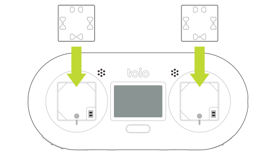
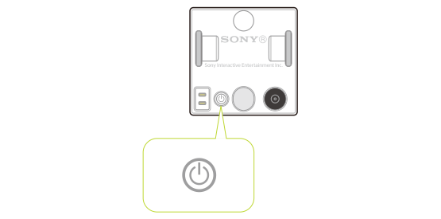

## How to charge

The cube can be charged by placing it on the console charger or the charger for toio Core Cube. For detailed instructions and how to check the remaining battery level of the cube, please refer to the [manuals](https://toio.io/manual).

## How to power on and off

There is a power button on the bottom of the cube. Press the power button to turn on the cube.
Pressing and holding the power button turns it off.

## Auto power off function

Communication with the cube is done via Bluetooth Low Energy (BLE). If the cube is not connected to any other device via BLE for 15 minutes, it will automatically turn off. An audible alert will also sound every 3 minutes while the cube is not connected to another device via BLE.

For more information on communication with the cube, please see [Communication Overview - Communication with the cube](ble_communication_overview.md#communication-with-the-cube).

## System state 

The state of the cube's system is notified through colors of the indicator and sound alerts. The different states are as follows.

| cube state      | Indicator                                    | Audible alert        |
| --------------- | -------------------------------------------- | -------------------- |
| Startup         | Flashes once in red, blue, green, then white | ○ With audible alert |
| Connecting      | Flashes in blue                              | No audible alert     |
| Connected       | Indicator turns off                          | ○ With audible alert |
| Disconnected    | Indicator turns off                          | ○ With audible alert |
| Shutdown        | Indicator turns off                          | ○ With audible alert |
| toio PlayGround | Flashes in yellow                            | ○ With audible alert |

### toio PlayGround 

When flashing yellow, toio PlayGround is in operation.  
At this time, the cube does not accept external Bluetooth connections.

#### Transition to toio PlayGround

When the button is pressed and held while the cube is waiting for connection (blinking blue), it transitions to toio PlayGround.

#### Return from toio PlayGround

To return to the normal connectivity state from toio PlayGround, turn the cube off and on again.

## Checking the remaining battery level

When the power button is pressed while the cube is on, the approximate remaining battery level is indicated through the color of the indicator and audible alerts. The remaining battery level and the corresponding condition of the indicator are shown below. Audible alerts are sounded as the indicator flashes.

| Remaining battery level     | Indicator                    | Audible alert                                |
| --------------------------- | ---------------------------- | -------------------------------------------- |
| Battery level is sufficient | Flashes in green three times | Sounds three times as the indicator flashes  |
| Battery level is low        | Flashes in yellow twice      | Sounds twice as the indicator flashes        |
| Almost no battery left      | Flashes in red once          | Sounds once with each flash of the indicator |
