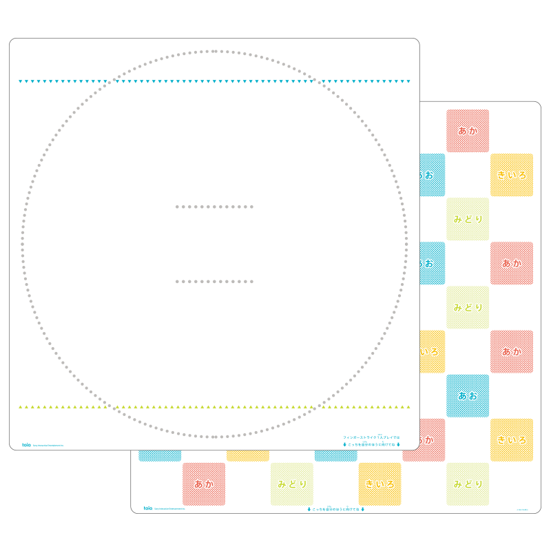
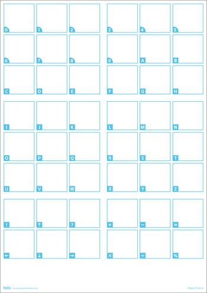
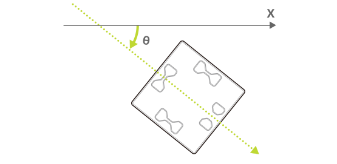

The "Play mat" and "Various Cards/Sheets" included in the [toio COLLECTION](https://toio.io/titles/toio-collection.html) and the "Simple play mat" and "Simple card" included with the [toio Core Cube (single package)](https://toio.io/cube) are printed with special patterns. These patterns are called "toio ID".
The "Identification sensor" on the bottom of the cube scans the unique information from the pattern and identifies its position on the object with the pattern printed (absolute position detection).

The information that the identification sensor scans from the toio ID can be obtained by using the following characteristics.

| Property            | Value                                              |
| ------------------- | -------------------------------------------------- |
| Characteristic UUID | 10B20101-5B3B-4571-9508-CF3EFCD7BBAE               |
| Properties          | [Read](#read-operations), [Notify](#notifications) |
| Descriptor          | ID Information                                     |

## toio ID types

There are two types of toio ID, Position ID and Standard ID, and the information that can be obtained from each differs as shown below. For details, please refer to the respective pages.

- [Hardware Specifications - Position ID](info_position_id.md)
- [Hardware Specifications - Standard ID](info_standard_id.md)

| toio ID type | Example of object with printed pattern                                                                                                                                                                                                                                                 | Information that can be obtained |
| ------------ | -------------------------------------------------------------------------------------------------------------------------------------------------------------------------------------------------------------------------------------------------------------------------------------- | -------------------------------- |
| Position ID  | Play mat included with the toio COLLECTION  Simple play mat included with toio Core Cube (single package)                            | Position and angle of the cube   |
| Standard ID  | Various Cards and Sheets included in the toio COLLECTION  Simple card included with the toio Core Cube (single package)    | Unique values and angle of cube  |

## Read operations

### Position ID

The information that the cube receives from the Position ID can be obtained with the following configuration data.
The interval and conditions for the notifications can be changed under [Configuration - Identification sensor ID notification settings](configuration.md#identification-sensor-id-notification-settings).

| Data location | Type   | Content                                         | Example                                         |
| ------------- | ------ | ----------------------------------------------- | ----------------------------------------------- |
| 0             | UInt8  | Information type                                | `0x01` (Position ID) |
| 1             | UInt16 | X coordinate value of the center of the cube    | `0x02c5` (709)                                  |
| 3             | UInt16 | Y coordinate value of the center of the cube    | `0x017f` (383)                                  |
| 5             | UInt16 | Y coordinate value of the center of the cube    | `0x0132` (306 degrees)                          |
| 7             | UInt16 | X coordinate value of the identification sensor | `0x02bc` (700)                                  |
| 9             | UInt16 | Y coordinate value of the identification sensor | `0x0182` (386)                                  |
| 11            | UInt16 | Y coordinate value of the identification sensor | `0x0132` (306 degrees)                          |

:::note

Byte order is little-endian. For other ways the data structures are expressed see [Function usage - Data structures](how_to_communicate.md#data-structures).

:::

#### Coordinates (X coordinate, Y coordinate)

The X and Y coordinates indicate the cube's position at the Position ID.
They are uniquely defined by toio ID, and are **not expressed in millimeters**.
Refer to [Hardware Specifications - Position ID](info_position_id.md) for the actual coordinates that can be obtained.

#### Angle

The angle is the orientation of the cube atop the Position ID. In the following figure, the X-axis direction is 0 degrees and clockwise is the positive direction.
The range of values is 0 to 360 degrees.

### Standard ID

The information that the cube receives from the Standard ID can be obtained with the following configuration data. The interval and conditions for the notifications can be changed under [Configuration - Identification sensor ID notification settings](configuration.md#identification-sensor-id-notification-settings).

| Data location | Type   | Content           | Example                                         |
| ------------- | ------ | ----------------- | ----------------------------------------------- |
| 0             | UInt8  | Information type  | `0x02` (Standard ID) |
| 1             | UInt32 | Standard ID value | `0x00380000`  (3670016: Typhoon)            |
| 5             | UInt16 | cube angle        | `0x0015` (21 degrees)                           |

:::note

Byte order is little-endian. For other ways the data structures are expressed see [Function usage - Data structures](how_to_communicate.md#data-structures).

:::

#### Standard ID values

A unique value that does not depend on the position of the cube can be obtained from the Standard ID. This value can be used to determine the item on which the cube is placed. See [Hardware Specifications - Standard ID](info_standard_id.md) for the actual values that can be obtained.

#### Angle of cube

The angle of the cube is the orientation of the cube atop the Standard ID. Values range from 0 to 360 degrees.

### Position ID missed

Information indicating that the cube has been removed from atop the Position ID can be obtained with the following configuration data.
The notification sensitivity can be changed under [Configuration - Identification sensor ID missed notification settings](configuration.md#identification-sensor-id-missed-notification-settings).

| Data location | Type  | Content          | Example                                                |
| ------------- | ----- | ---------------- | ------------------------------------------------------ |
| 0             | UInt8 | Information type | `0x03` (Position ID missed) |

### Standard ID missed

Information indicating that the cube has been removed from atop the Standard ID can be obtained with the following configuration data.
The notification sensitivity can be changed under [Configuration - Identification sensor ID missed notification settings](configuration.md#identification-sensor-id-missed-notification-settings).

| Data location | Type  | Content          | Example                                                |
| ------------- | ----- | ---------------- | ------------------------------------------------------ |
| 0             | UInt8 | Information type | `0x04` (Standard ID missed) |

## Notifications

When the information scanning by the identification sensor changes, this property notifies the BLE central of this information.
The notified information and data structure are the same as those obtained using the [Read operations](#read-operations).
