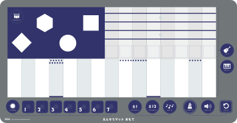
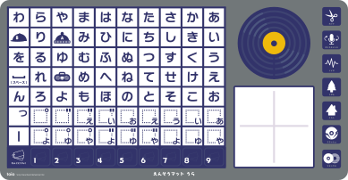
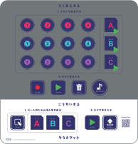

The following products have Position ID printed on them.

- Play mat included with the [toio COLLECTION](https://toio.io/titles/toio-collection.html)
- Play mat and "Control/Autoplay" mat included with [PICOTONS™](https://toio.io/titles/picotons.html)
- Simple play mat included with the [toio Core Cube (single package)](https://toio.io/cube/)
- Play mat included with [Papercraft Creatures - Gesundroid](https://toio.io/titles/gesundroid.html)

The detailed information on each are as follows. For information on how to scan information using BLE, please refer to [Identification sensor](./id.md)

## Play mat included with the toio COLLECTION

|                         | Top-left X coordinate | Top-left Y coordinate | Bottom-right X coordinate | Bottom-right Y coordinate |
| ----------------------- | --------------------- | --------------------- | ------------------------- | ------------------------- |
| Side with ring          | 45                    | 45                    | 455                       | 455                       |
| Side with colored tiles | 545                   | 45                    | 955                       | 455                       |

## Mats included with PICOTONS

### Play mat (front)

| Top-left X coordinate | Top-left Y coordinate | Bottom-right X coordinate | Bottom-right Y coordinate |
| --------------------- | --------------------- | ------------------------- | ------------------------- |
| 59                    | 2088                  | 437                       | 2285                      |

### Play mat (back)

| Top-left X coordinate | Top-left Y coordinate | Bottom-right X coordinate | Bottom-right Y coordinate |
| --------------------- | --------------------- | ------------------------- | ------------------------- |
| 59                    | 2303                  | 437                       | 2499                      |

### Control mat

| Top-left X coordinate | Top-left Y coordinate | Bottom-right X coordinate | Bottom-right Y coordinate |
| --------------------- | --------------------- | ------------------------- | ------------------------- |
| 764                   | 2093                  | 953                       | 2290                      |

### Autoplay mat

| Top-left X coordinate | Top-left Y coordinate | Bottom-right X coordinate | Bottom-right Y coordinate |
| --------------------- | --------------------- | ------------------------- | ------------------------- |
| 554                   | 2093                  | 742                       | 2290                      |

## Simple play mat included with the toio Core Cube (single package)

| Top-left X coordinate | Top-left Y coordinate | Bottom-right X coordinate | Bottom-right Y coordinate |
| --------------------- | --------------------- | ------------------------- | ------------------------- |
| 98                    | 142                   | 402                       | 358                       |

## Play mat included with Papercraft Creatures - Gesundroid

To use the play mat, the system software needs to be updated to v02.0004 or later.
For information on the system software versions and how to update your software, please see [Introduction – About updates](./how_to_update_cube.md).

| Top-left X coordinate | Top-left Y coordinate | Bottom-right X coordinate | Bottom-right Y coordinate |
| --------------------- | --------------------- | ------------------------- | ------------------------- |
| 1050                  | 45                    | 1460                      | 455                       |
