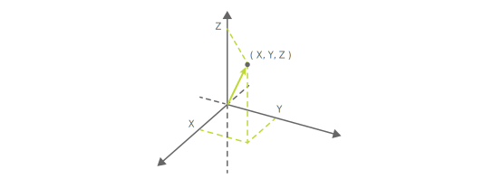

The cube can use magnetic sensors to detect the type (predefined layout patterns) or magnetic force with the magnet located at the top of a cube. For the hardware specifications of these, see [Hardware specifications - Magnetic sensor](hardware_magnet.md).

:::note

This feature is **disabled** by default. It can only be used after it is enabled under [Configuration - Magnetic sensor settings](configuration.md#magnetic-sensor-settings).

:::

Magnetic sensor information can be obtained using the following characteristics. The characteristics are the same for [Motion detection](sensor.md) and [Posture Angle detection](high_precision_tilt_sensor.md).

| Property            | Value                                                                                                          |
| ------------------- | -------------------------------------------------------------------------------------------------------------- |
| Characteristic UUID | 10B20106-5B3B-4571-9508-CF3EFCD7BBAE                                                                           |
| Properties          | [Write](#write-operations), [Read](#read-operations--notifications), [Notify](#read-operations--notifications) |
| Descriptor          | Sensor information                                                                                             |

## Write operations

### Requests for magnetic sensor information

Magnetic sensor information can be requested by writing the following data. When the cube receives a request, it sends one notification with the magnetic sensor information.

| Data location | Type  | Content          | Example                                                                 |
| ------------- | ----- | ---------------- | ----------------------------------------------------------------------- |
| 0             | UInt8 | Information type | `0x82` (Magnetic sensor information request) |

## Read operations / Notifications

When the cube's magnetic sensor information changes, this property notifies the BLE central of this information.
The notified information can also be obtained with a read operation.

:::note

The characteristics are the same for [Motion detection](sensor.md) and [Posture Angle detection](high_precision_tilt_sensor.md). As this information is also obtained, please also see [Motion detection - Read operations / Notifications](sensor.md#read-operations--notifications) and [Posture Angle detection - Read operations / Notifications](high_precision_tilt_sensor.md#read-operations--notifications) when using.

:::

### Obtaining magnetic sensor information

| Data location | Type  | Content                           | Example                                                         |
| ------------- | ----- | --------------------------------- | --------------------------------------------------------------- |
| 0             | UInt8 | Information type                  | `0x02` (Magnetic sensor information) |
| 1             | UInt8 | Magnet state                      | `0x00` (Not installed or function disabled)                     |
| 2             | UInt8 | Magnetic force strength           | `0x00` (Not detected or function disabled)                      |
| 3             | Int8  | Magnetic force direction (X axis) | `0x00` (Not detected or function disabled)                      |
| 4             | Int8  | Magnetic force direction (Y axis) | `0x00` (Not detected or function disabled)                      |
| 5             | Int8  | Magnetic force direction (Z axis) | `0x00` (Not detected or function disabled)                      |

#### Magnet state

This is the ID of the state of the magnet located at the top of the cube (uninstalled or predefined layouts). The ID is `0x00` when no magnets are installed, and when there are magnets installed, the ID ranges between `0x01` and `0x06` for each of the 6 layout patterns. For the specifications of the layout patterns, see [Hardware specifications - Magnetic sensor](hardware_magnet.md).

The information is not be updated if the sensor detects a state other than these 7 different layout patterns (no magnets installed or one of the 6 layout patterns) defined in [Hardware specifications - Magnetic sensor](hardware_magnet.md).

#### Magnetic force detection

When magnet is placed near the cube, the cube detects the magnetic force and makes a response.

##### Magnetic force strength

The magnetic force strength is the strength of the magnetic force detected by the cube.
This magnetic force strength is expressed in values ranging between 0 and 255. The higher the value, the stronger the magnetic force.

##### Magnetic force direction

The magnetic force direction indicates the direction of the magnetic force lines relative to the cube.
The values for each axis range between -10 and 10. When there is no magnetic force detected, the value is 0.
The length of the magnetic force direction 3D vector is not proportional to the magnetic force strength.
When magnetic force is detected, the length of the vector is almost constant (about 10).

For how the direction of the cube corresponds to the direction of the magnetic force lines, see [Hardware specifications - Magnetic sensor](hardware_magnet.md#2-magnetic-force-detection).
