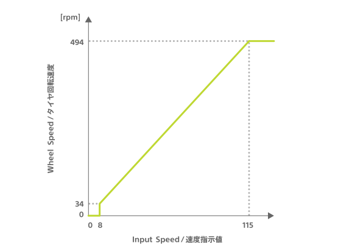
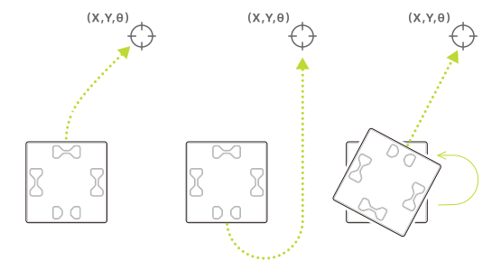

The cube has two motors, with one connected to the left wheel and one to the right wheel (see [Parts](hardware_components.md)).
These motors can be controlled using the following characteristics.

| Property            | Value                                                                                                                           |
| ------------------- | ------------------------------------------------------------------------------------------------------------------------------- |
| Characteristic UUID | 10B20102-5B3B-4571-9508-CF3EFCD7BBAE                                                                                            |
| Properties          | [Write without response](#write-operations), [Read](#read-operations--notifications), [Notify](#read-operations--notifications) |
| Descriptor          | Motor Control                                                                                                                   |

## Write operations

### Motor Control

The motor can be controlled by writing the following configuration data. The motors continue to run at the specified speed until the next write operation is performed.

| Data location | Type  | Content                    | Example                                           |
| ------------- | ----- | -------------------------- | ------------------------------------------------- |
| 0             | UInt8 | Control type               | `0x01` (Motor control) |
| 1             | UInt8 | ID of motor controlled     | `0x01` (Left)                                     |
| 2             | UInt8 | Motor rotation direction   | `0x01` (Forward)                                  |
| 3             | UInt8 | Motor speed command values | `0x64` (100)                                      |
| 4             | UInt8 | ID motor controlled        | `0x02` (Right)                                    |
| 5             | UInt8 | Motor rotation direction   | `0x02` (Backward)                                 |
| 6             | UInt8 | Motor speed command values | `0x14` (20)                                       |

#### ID motor controlled

Specifies the ID of the motor being controlled. The ID of the left motor is `1` and the ID of the right motor is `2`.
As there are two locations for which motor ID are specified, if both are specified with the same ID, an error occurs and the write operation is ignored.

#### Motor rotation direction

Specifies the rotation direction for the motor that was just specified.
The value for moving the cube forward is `1` and the value for moving it backward is `2`.

#### Motor speed command values

Specify the rotation speed for the motor that was just specified.
The speed of the motor can be specified with values ranging between `0` and `255`. The correlation between the speed of the motor and the actual rotation speed of the wheels is shown in the graph below.

### Motor control with specified duration

The duration of the operation can be specified with the control of the motors by writing the following configuration data.
The motor stops after the specified time has elapsed.

| Data location | Type  | Content                    | Example                                                                   |
| ------------- | ----- | -------------------------- | ------------------------------------------------------------------------- |
| 0             | UInt8 | Control type               | `0x02` (Motor control with specified duration) |
| 1             | UInt8 | ID of motor controlled     | `0x01` (Left)                                                             |
| 2             | UInt8 | Motor rotation direction   | `0x01` (Forward)                                                          |
| 3             | UInt8 | Motor speed command values | `0x64` (100)                                                              |
| 4             | UInt8 | ID motor controlled        | `0x02` (Right)                                                            |
| 5             | UInt8 | Motor rotation direction   | `0x02` (Backward)                                                         |
| 6             | UInt8 | Motor speed command values | `0x14` (20)                                                               |
| 7             | UInt8 | Motor control duration     | `0x0A` (100 msec)                                                         |

#### Motor control duration

The duration in which the motor is controlled is specified with values ranging from `0` to `255`. A value of `0` means that there is no time limit and the motor continues to run at the specified speed until the next write operation is performed. For values ranging between `1` and `255`, the motor for 10 times the specified value in milliseconds, then stops.

### Motor control with target specified

Motors can be controlled with a target state specified to make the cube move autonomously. Targets that can be set are made up of the following.

- X coordinate of the target point's Position ID
- Y coordinate of the target point's Position ID
- Θ angle of the cube at the target point

The cube stops the motors when the central X coordinate, Y coordinate, and angle reach the target, and responds with `0x00: Normal end`. Or, if an error such as a timeout occurs, it responds with the corresponding error. For more information about the responses, refer to [Responses to motor control with target specified](#responses-to-motor-control-with-target-specified).

The state of having reached the target is defined as "values of X and Y coordinates within 15 and the difference in angles within 4 degrees."

| Data location | Type   | Content                                 | Example                                                                 |
| ------------- | ------ | --------------------------------------- | ----------------------------------------------------------------------- |
| 0             | UInt8  | Control type                            | `0x03` (Motor control with target specified) |
| 1             | UInt8  | Control distinction value               | `0x00`                                                                  |
| 2             | UInt8  | Timeout period                          | `0x05` (5 seconds)                                                      |
| 3             | UInt8  | Movement type                           | `0x00` (Moving while rotating)                                          |
| 4             | UInt8  | Value indicating maximum motor speed    | `0x50` (80)                                                             |
| 5             | UInt8  | Motor speed change types                | `0x00` (Constant speed)                                                 |
| 6             | UInt8  | Reserved                                | `0x00`                                       |
| 7             | UInt16 | X coordinate value of the target point  | `0x02bc` (700)                                                          |
| 9             | UInt16 | Y coordinate value of the target point  | `0x0182` (386)                                                          |
| 11            | UInt16 | Θ angle of the cube at the target point | `0x005a` (90 degrees)                                                   |

:::note

Byte order is little-endian. For other ways data structures are expressed, see [Function usage - Data structures](how_to_communicate.md#data-structures).

:::

#### Control distinction value

These values are used to distinguish between the corresponding [Responses to motor control with target specified](#responses-to-motor-control-with-target-specified). The value set for this is also included in the corresponding response. This allows for the identification of the corresponding response when performing write operations consecutively. This can be freely set to a value ranging between `0` and `255`.

#### Timeout period

If the cube has not reached the target point after the timeout period set has passed, the cube stops moving and responds with `0x01: Timeout`.
The timeout period is specified with values ranging between `0` and `255`. These values are in seconds. The only exception is `0`, which is 10 seconds. The cube cannot be set to not timeout.

#### Movement type

Select one of the following three ways for the cube to move to the target point. When rotating the cube in one spot, the resulting movement is the same no matter which type is chosen.

| Value | Method of movement                             |
| ----- | ---------------------------------------------- |
| `0`   | Move while rotating                            |
| `1`   | Move while rotating (without moving backwards) |
| `2`   | Rotate after moving                            |

Movement of each movement type: from left to right <code>0</code>, <code>1</code>, <code>2</code>
.

#### Maximum motor speed command value

Specifies the maximum speed at which the cube can move. The cube moves at no more than the specified speed.
The valid values for maximum speed range between `10` and `255`. If a value less than `10` is specified, the command is discarded and the cube responds with `0x06: not supported`. The correlation between the speed command value and wheel rotation speed is the same as for [Motor speed command values](#motor-speed-command-values).

#### Motor speed change types

Select one of the following 4 types of Motor speed change types for the cube moving towards the target point.

| Value  | Speed change type                                                                                     |
| ------ | ----------------------------------------------------------------------------------------------------- |
| `0x00` | Speed constant                                                                                        |
| `0x01` | Gradual acceleration towards the target point                                                         |
| `0x02` | Gradual deceleration towards the target point                                                         |
| `0x03` | Gradual acceleration halfway until the target point, then deceleration from there to the target point |

#### Target point X coordinates and Y coordinates

Specifies the X and Y coordinates of the target point. The range of values is between `0x0000` and `0xffff` for both, and only `0xffff` is the value for "same as for write operation". For the correlation between the printed Position ID and coordinates, see [Identification sensor - Position ID - Coordinate (X coordinate, Y coordinate)](id.md#coordinates-x-coordinate-y-coordinate).

#### Θ Angle of the cube at the target point

After the cube reaches the target X and Y coordinates, it will rotate to the specified angle. The angle is specified with values ranging between `0x0000` and `0x1ffffff` for the lower 13 bits of the total of 16 bits. The top 3 bits are specified with one of the following values. The angle and movement expressed by the lower 13 bits vary based on these values.

| Top 3 bit value | Angle                        | Direction of rotation                 |
| --------------- | ---------------------------- | ------------------------------------- |
| `0x00`          | Angle                        | Direction of least amount of rotation |
| `0x01`          | Angle                        | Forward direction                     |
| `0x02`          | Angle                        | Negative direction                    |
| `0x03`          | Relative angle               | Forward direction                     |
| `0x04`          | Relative angle               | Negative direction                    |
| `0x05`          | No angle specified           | No rotation                           |
| `0x06`          | Same as with write operation | Direction of least amount of rotation |

In the case of an absolute angle, the angle is the orientation with respect to the Position ID. In the case of a relative angle, the angle corresponds to the state of the cube when it arrives at the target point. For `0x05: No angle specified`, the lower 13 bits are ignored and motor control is terminated without rotation when the X and Y coordinates of the target point are reached. For `0x06: Same as with the write operation`, the lower 13 bits are ignored and rotation is performed in the same direction as the write operation.

See [Identification sensor - Position ID - Angle](id.md#angle) for the angle and rotation direction on the Position ID.

### Motor control with multiple targets specified

[Motor control with target specified](#motor-control-with-target-specified) can be expanded to control a motor with multiple targets specified. In the example, 3 targets are pursued in order. When the cube reaches the last target, it stops the motor and responds with `0x00: Completed successfully`. If an error such as a timeout occurs, it responds with the corresponding error. For more information about the responses, refer to [Responses to motor control with multiple targets specified](#responses-to-motor-control-with-multiple-targets-specified).

| Data location | Type   | Content                               | Example                                                                           |
| ------------- | ------ | ------------------------------------- | --------------------------------------------------------------------------------- |
| 0             | UInt8  | Control type                          | `0x04` (Motor control with multiple targets specified) |
| 1             | UInt8  | Control distinction value             | `0x00`                                                                            |
| 2             | UInt8  | Timeout period                        | `0x05` (5 seconds)                                                                |
| 3             | UInt8  | Movement type                         | `0x00` (Move while rotating)                                                      |
| 4             | UInt8  | Value indicating maximum motor speed  | `0x50` (80)                                                                       |
| 5             | UInt8  | Motor speed change types              | `0x00` (Speed constant)                                                           |
| 6             | UInt8  | Reserved                              | `0x00`                                                 |
| 7             | UInt8  | Write operation addition setting      | `0x01` (Additional)                                                               |
| 8             | UInt16 | X coordinate value of target point 1  | `0x0064` (100)                                                                    |
| 10            | UInt16 | Y coordinate value of target point 1  | `0x0064` (100)                                                                    |
| 12            | UInt16 | Θ Angle of cube at target point 1     | `0x0000` (0 degrees)                                                              |
| 14            | UInt16 | X coordinate value of target point 2  | `0x00c8` (200)                                                                    |
| 16            | UInt16 | Y coordinate value of target point 2  | `0x0064` (100)                                                                    |
| 18            | UInt16 | Θ Angle of the cube at target point 2 | `0x005f` (90 degrees)                                                             |
| 20            | UInt16 | X coordinate value of target point 3  | `0x00c8` (200)                                                                    |
| 22            | UInt16 | Y coordinate value of target point 3  | `0x00c8` (200)                                                                    |
| 24            | UInt16 | Θ Angle of the cube at target point 3 | `0x00b4` (180 degrees)                                                            |

:::note

Byte order is little-endian. For other ways data structures are expressed, see [Function usage - Data structures](how_to_communicate.md#data-structures).

:::

#### Data structure

The data for this write operation has a structure where the data length can change depending on the number of targets specified. As shown in the example above, up to 29 targets can be specified by adding target information to the end of the data in the order of the X coordinate, Y coordinate, and cube angle. If there is no target information or more than 29 targets, an error occurs and the write operation is discarded. The more targets there are, the larger the data size will be. Note that depending on the data size, there may be delays due to the restraints of the BLE range.

#### Control distinction values

These values are used to distinguish between the corresponding [Responses to motor control with target specified](#responses-to-motor-control-with-target-specified). The value set for this is also included in the corresponding response. This allows for the identification of the corresponding response when performing write operations consecutively. This can be freely set to a value ranging between `0` and `255`.

#### Timeout period

If the cube has not reached the target after the timeout period set has passed, the cube stops moving and responds with `0x01: Timeout`. The cube does not move towards any subsequent target points after this. When the cube reaches a target point, the timer resets and the timer starts for the cube to reach the next target point. Timeout period is specified with values ranging between `0` and `255`. These values are in seconds. The only exception is `0`, which is 10 seconds. The cube cannot be set to not timeout.

#### Movement type and maximum motor speed command values

Values are the same as those for [Motor control with target specified](#motor-control-with-target-specified).

#### Motor speed change types

The values that can be specified and their range are the same as for [Motor control with target specified](#motor-control-with-target-specified). These values can be applied along the path of the cube takes to reach its target points.

#### Additional write operation settings

These values are to set the cube operations when a write operation is added. `0x00: overwrite` or `0x01: add` can be specified.

Generally, when a motor control value is written while a different motor control value is being performed, the control action being performed is overwritten (stopped and discarded) and the performance of the newly written control value begins. If `0x00: overwrite` is specified, this overwrite operation is performed.

If `0x01: add` is specified, only in the case the following 2 conditions are met, **one** write operation is added, put on hold, and automatically performed once the motor control being performed is complete.

- The motor control action currently being executed is **a motor control with multiple targets specified**.
- There are no motor control values with multiple targets specified added.

Even if `0x01: Add` is specified, if the motor control value currently being performed is not a motor control with multiple targets specified, the resulting operation is the same as `0x00: Overwrite`, and the motor control action currently being performed is overwritten (stopped and discarded). If there is a motor control with multiple targets already added, the write operation is discarded and the cube responds with `0x07: Cannot add write operation` of the [Responses to motor control with multiple targets specified](#responses-to-motor-control-with-multiple-targets-specified).

#### X and Y coordinates of the target point

The values and range of values that can be specified are essentially the same as for [Motor control with target specified](#motor-control-with-target-specified). However, for the second and subsequent target points, `0xffff` is not "the same as for the writing operation" but "the same as the settings for the previous target point".

#### Θ angle of the cube at the target point

The values and range of values that can be specified are essentially the same as for [Motor control with target specified](#motor-control-with-target-specified). However, for the second and subsequent target points, `0x06` for the top 3 bits is not "the same as for the writing operation" but "the same as the settings for the previous target point". The "relative angle" is based on the angle of the cube when the write operation is performed.

### Motor control with acceleration specified

The cube's motors can be controlled with the acceleration specified by writing the following configuration data. The cube can also be controlled with its translational speed and rotational speed specified instead of the speed of each motor. In the example, the cube moves slowly along an arc for one second.

| Data location | Type   | Content                                            | Example                                                                       |
| ------------- | ------ | -------------------------------------------------- | ----------------------------------------------------------------------------- |
| 0             | UInt8  | Control type                                       | `0x05` (Motor control with acceleration specified) |
| 1             | UInt8  | Translational speed of cube                        | `0x32` (50)                                                                   |
| 2             | UInt8  | Acceleration of cube                               | `0x05` (5)                                                                    |
| 3             | UInt16 | Rotational velocity when cube changes orientation  | `0x000F` (15 degrees/second)                                                  |
| 5             | UInt8  | Rotational direction when cube changes orientation | `0x00` (Forward)                                                              |
| 6             | UInt8  | Direction of cube travel                           | `0x00` (Forward)                                                              |
| 7             | UInt8  | Priority designation                               | `0x00` (Translational speed prioritized)                                      |
| 8             | UInt8  | Duration of control                                | `0x64` (1 second)                                                             |

:::note

Byte order is little-endian. For other ways data structures are expressed, see [Function usage - Data structures](how_to_communicate.md#data-structures).

:::

#### Translational speed of cube

Specifies the speed at which the cube moves in relation to the direction of travel. The value range and correlation to the rotational speed of the wheels are the same as for [Motor speed command values](#motor-speed-command-values).

#### Acceleration of cube

Specify the increment (or decrement) in speed every 100 milliseconds. Acceleration ends when the speed of the cube reaches the speed specified for "Translational speed of cube". Values range between `0` and `255`. If `0` is specified, the speed of the cube becomes the speed specified for "Translational speed of cube" immediately after the write operation is executed. This setting is only effective when motor control values with acceleration is being written consecutively. If the cube is running with any other motor control, this value is ignored, and the speed specified for "Translational speed of cube" is specified immediately after the write operation is executed just as when `0` is specified.

#### Rotational velocity when cube changes orientation

Specifies the rotational velocity when the cube is changing orientation. The values that can be specified for this ranges between `0x00` and `0xffff` in degrees per second.

#### Rotational direction when cube changes orientation

Specifies the rotational direction when the cube is changing orientation. See [Identification sensor - Position ID - Angle](id.md#angle) for the angles and rotational directions based on the Position ID.

#### Direction of cube travel

Specifies the direction the cube travels.`0` is forward and `1` is backward.

#### Priority designation

Depending on how the translational speed and rotational velocity are combined, the range of speed specification values that can be specified for the motor may be exceeded. When this is the case, this parameter specifies whether to give priority to the translational speed or the rotational velocity. `0` gives priority to the translational speed and adjusts the rotational velocity. `1` gives priority to the rotational velocity and adjusts the translational speed.

#### Duration of control

Specifies the duration ranging between `0` and `255` in which the motor is controlled. A value of `0` specifies for there to be no time limit and the motor continues to run at the specified speed until the next write operation action is performed. In the `1` to `255` value range, the motor runs for 10 times the specified value in milliseconds, then stops.

## Read operations / Notifications

This characteristic notifies the BLE central of information. The information being notified can also be obtained through read operations, and the content of this information can be determined with the value at the beginning of the data, as shown below.

| Beginning of data | Information                                                                                                               |
| ----------------- | ------------------------------------------------------------------------------------------------------------------------- |
| `0x83`            | [Responses to motor control with target specified](#responses-to-motor-control-with-target-specified)                     |
| `0x84`            | [Responses to motor control with multiple targets specified](#responses-to-motor-control-with-multiple-targets-specified) |
| `0xe0`            | [Obtaining motor speed information](#obtaining-motor-speed-information)                                                   |

### Responses to motor control with target specified

After [Motor control with target specified](#motor-control-with-target-specified) is written, the following configuration data is sent as a response once only.

| Data location | Type  | Content                      | Example                                                                             |
| ------------- | ----- | ---------------------------- | ----------------------------------------------------------------------------------- |
| 0             | UInt8 | Control type                 | `0x83` (Response to motor control with target specified) |
| 1             | UInt8 | Control identification value | `0x00`                                                                              |
| 2             | UInt8 | Response content             | `0x00` (Completed successfully)                                                     |

#### Control identification value

The value set for the corresponding [Motor control with target specified](#motor-control-with-target-specified).

#### Response content

The response content is one of the following depending on the content of the written data and result of execution.

| Value  | Content                           | State                                                                                                                                                                                                       |
| ------ | --------------------------------- | ----------------------------------------------------------------------------------------------------------------------------------------------------------------------------------------------------------- |
| `0x00` | Completed successfully            | When target is reached.  Motors stop.                                                                                                                                                                   |
| `0x01` | Timeout                           | When the specified timeout period has elapsed.  Motors stop.                                                                                                                                            |
| `0x02` | toio ID missed                    | When the cube is in a location without toio ID.  Motors stop.                                                                                                                                           |
| `0x03` | Invalid combination of parameters | When the X coordinate, Y coordinate, and angle are `the same as what is currently written`. Write operation is discarded.                                                                               |
| `0x04` | Invalid state                     | When cube is turned off. Cube is turned off after a notification on the response is received.                                                                                                           |
| `0x05` | Other written control accepted    | When a motor control that isn't a motor control with multiple target s specified is written.  The motor control currently being performed is terminated and a newly written motor control is performed. |
| `0x06` | Not supported                     | When the maximum speed command value of the specified motor is less than `8`.  Write operation is discarded.                                                                                            |

### Responses to motor control with multiple targets specified

After [Motor control with multiple targets specified](#motor-control-with-multiple-targets-specified) is written, the following configuration data is sent once as a response.

| Data location | Type  | Content                      | Example                                                                                       |
| ------------- | ----- | ---------------------------- | --------------------------------------------------------------------------------------------- |
| 0             | UInt8 | Control type                 | `0x84` (Response to motor control with multiple targets specified) |
| 1             | UInt8 | Control identification value | `0x00`                                                                                        |
| 2             | UInt8 | Response content             | `0x00` (Completed successfully)                                                               |

#### Control identification value

The value set with the corresponding [Motor control with multiple targets specified](#motor-control-with-multiple-targets-specified).

#### Response content

The response content is one of the following depending on the written data content and execution results.

| Value  | Content                           | State                                                                                                                                                                                                       |
| ------ | --------------------------------- | ----------------------------------------------------------------------------------------------------------------------------------------------------------------------------------------------------------- |
| `0x00` | Completed successfully            | When target is reached.  Motors stop.                                                                                                                                                                   |
| `0x01` | Timeout                           | When the specified timeout period has elapsed.  Motors stop.                                                                                                                                            |
| `0x02` | toio ID missed                    | When the cube is in a location without toio ID.  Motors stop.                                                                                                                                           |
| `0x03` | Invalid combination of parameters | When the X coordinate, Y coordinate, and angle are `the same as what is currently written`. Write operation is discarded.                                                                               |
| `0x04` | Invalid state                     | When cube is turned off. Cube is turned off after a notification on the response is received.                                                                                                           |
| `0x05` | Other written control accepted    | When a motor control that isn't a motor control with multiple target s specified is written.  The motor control currently being performed is terminated and a newly written motor control is performed. |
| `0x06` | Not supported                     | When the maximum speed command value of the specified motor is less than `8`.  Write operation is discarded.                                                                                            |
| `0x07` | Write operation cannot be added   | When a write operation cannot be added. Write operation is discarded.                                                                                                                                   |

### Obtaining motor speed information

There is a sensor in the cube that detects the speed of the motors. Information can be obtained from this sensor with the following configuration data. The information is updated and notified at 100 millisecond intervals. If there are no changes in the value, no notification is sent.

:::note

This function is **disabled** by default. When necessary, it can be enabled under [Configuration - Motor speed information acquisition settings](configuration.md#motor-speed-information-acquisition-settings).

:::

| Data location | Type  | Content                     | Example                                                         |
| ------------- | ----- | --------------------------- | --------------------------------------------------------------- |
| 0             | UInt8 | Information type            | `0xe0` (Obtaining speed information) |
| 1             | UInt8 | Speed of motor ID 1 (left)  | `0x32` (50)                                                     |
| 2             | UInt8 | Speed of motor ID 2 (right) | `0x00` (0)                                                      |

#### Speed

This is the speed of each motor. The values are in the same units as the [Motor speed command values](#motor-speed-command-values) entered for [Motor control](#motor-control).
