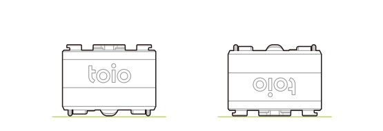
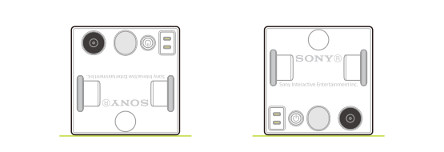
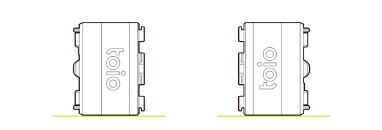

The cube can detect information on the state of the cube such as the cube posture and collisions with motion sensors (6-axis detection system).

This information can be obtained using the following characteristics. The characteristics are the same as for [Magnetic sensor](magnetic_sensor.md) and [Posture Angle detection](high_precision_tilt_sensor.md).

| Property            | Value                                                                                                          |
| ------------------- | -------------------------------------------------------------------------------------------------------------- |
| Characteristic UUID | 10B20106-5B3B-4571-9508-CF3EFCD7BBAE                                                                           |
| Properties          | [Write](#write-operations), [Read](#read-operations--notifications), [Notify](#read-operations--notifications) |
| Descriptor          | Sensor Information                                                                                             |

## Write operations

### Requesting motion detection information

The following data can be written to request motion detection information. When the cube receives a request, it sends one notification with the motion detection information.

| Data location | Type  | Content          | Example                                                                      |
| ------------- | ----- | ---------------- | ---------------------------------------------------------------------------- |
| 0             | UInt8 | Information type | `0x81` (Request for motion detection information) |

## Read operations / Notifications

When the cube's motion sensor information changes, this characteristic notifies the BLE central of the new information. The notified information can also be obtained with a read operation.

:::note

The characteristics are the same as those for [Magnetic sensor](magnetic_sensor.md) and [Posture Angle Detection](high_precision_tilt_sensor.md). As this information is also obtained, please also see [Magnetic sensor - Read operations / Notifications](magnetic_sensor.md#read-operations--notifications) and [Posture Angle detection - Read operations / Notifications](high_precision_tilt_sensor.md#read-operations--notifications) when using.

:::

### Obtaining motion detection information

Information on the cube's motion detection can be obtained with the following configuration data.

| Data location | Type  | Content              | Example                                       |
| ------------- | ----- | -------------------- | --------------------------------------------- |
| 0             | UInt8 | Information type     | `0x01` (Detection) |
| 1             | UInt8 | Horizontal detection | `0x00` (Not horizontal)                       |
| 2             | UInt8 | Collision detection  | `0x00` (No collision)                         |
| 3             | UInt8 | Double-tap detection | `0x00` (No double-tap)                        |
| 4             | UInt8 | Posture detection    | `0x01` (Posture facing forward)               |
| 5             | UInt8 | Shake detection      | `0x00` (No shake)                             |

#### Horizontal detection

When the cube is horizontal, the value is `0x01` (horizontal), and when it is tilted at more than a certain angle (θ in the figure below), the value becomes `0x00` (not horizontal). The angle threshold can be set under [Configuration - Horizontal detection threshold settings](configuration.md#horizontal-detection-threshold-settings).

Roll orientation
.

Pitch orientation
.

#### Collision detection

When something collides with the cube, the value changes from `0x00` (no collision) to `0x01` (collision).
The threshold for the size of the collision that is detected can be set under [Configuration - Collision detection threshold settings](configuration.md#collision-detection-threshold-settings).

#### Double-tap detection

If the cube is tapped once and then tapped again within a certain period of time, the value changes from `0x00` (no double-tap) to `0x01` (with double-tap). The time interval between taps can be set under [Configuration - Double-tap detection time interval settings](configuration.md#double-tap-detection-time-interval-settings). The settings for the strength of taps that are detected are the same as for [Configuration - Collision detection threshold settings](configuration.md#collision-detection-threshold-settings).

#### Posture detection

This value changes when the orientation of the cube changes relative to the horizontal plane. The correlation between the values and the posture is as follows.

| Value | Cube posture            |
| ----- | ----------------------- |
| `1`   | Top faces upward        |
| `2`   | Bottom faces upward     |
| `3`   | Rear side faces upward  |
| `4`   | Front side faces upward |
| `5`   | Right side faces upward |
| `6`   | Left side faces upward  |

Cube posture: from left to right <code>1: Top faces upward</code> and <code>2: Bottom faces upward</code>
.

Cube posture: from left to right <code>3: Rear side faces upward</code> and <code>4: front side faces upward</code>
.

Cube posture: from left to right <code>5: Right side faces upward</code> and <code>6: Left side faces upward</code>
.

#### Shake detection

When the cube is shook, this value changes from `0x00` (no detection) to a value between `0x01` (Level 1) and `0x0a` (Level 10) depending on the strength of the shake.
