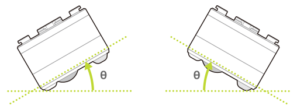

キューブは自身の通信仕様のバージョン情報や各種設定情報を内部に保存しています。
これらの情報は以下の特性（characteristic）を使うことで取得や変更ができます。

| プロパティ          | 値                                                             |
| ------------------- | -------------------------------------------------------------- |
| Characteristic UUID | 10B201FF-5B3B-4571-9508-CF3EFCD7BBAE                           |
| Properties          | [Write](#書き込み操作), [Read](#読み出し操作), [Notify](#通知) |
| Descriptor          | Configuration                                                  |

## 書き込み操作

### BLE プロトコルバージョンの要求

以下のデータを書き込むことでキューブの BLE プロトコルバージョンを要求できます。結果の取得方法は [BLE プロトコルバージョンの取得](#ble-プロトコルバージョンの取得)を参照してください。

| データ位置 | タイプ | 内容       | 例                                                          |
| ---------- | ------ | ---------- | ----------------------------------------------------------- |
| 0          | UInt8  | 設定の種類 | `0x01`（BLE プロトコルバージョンの要求） |
| 1          | UInt8  | Reserved   | `0x00`                                                      |

### 水平検出のしきい値設定

[モーションセンサー](sensor.md)で取得できる水平検出はキューブの底面と水平面のなす角度（下の図の θ）がしきい値を超えると`0x00`（水平でない）となります。以下のデータを書き込むことでこのしきい値を変更できます。

| データ位置 | タイプ | 内容           | 例                                                  |
| ---------- | ------ | -------------- | --------------------------------------------------- |
| 0          | UInt8  | 設定の種類     | `0x05`（水平検出のしきい値設定） |
| 1          | UInt8  | 角度のしきい値 | `0x0A` (10 度）                                     |

このしきい値はロール方向とピッチ方向の回転の両方に適用されます。デフォルトの値は 45 度となっており、キューブの接続が切れるとしきい値設定は破棄されデフォルトに戻ります。

**ロール方向**

**ピッチ方向**

| プロパティ      | 値の範囲         | デフォルト値 |
| --------------- | ---------------- | ------------ |
| Threshold angle | `1` - `45` (度） | `45` (度）   |

### 衝突検出のしきい値設定

[モーションセンサー](sensor.md)で取得できる衝突検出はキューブの受ける衝突の強さがしきい値を超えると`0x01`（衝突あり）となります。以下のデータを書き込むことでこのしきい値を変更できます。

| データ位置 | タイプ | 内容       | 例                                                  |
| ---------- | ------ | ---------- | --------------------------------------------------- |
| 0          | UInt8  | 設定の種類 | `0x06`（衝突検出のしきい値設定） |
| 1          | UInt8  | しきい値   | `0x0A` (level 10)                                   |

このしきい値の設定可能範囲とデフォルト値は以下のとおりです。値の大きは衝突の大きさを意味します。また、キューブの接続が切れるとしきい値設定は破棄されデフォルトに戻ります。

| プロパティ | 値の範囲           | デフォルト値 |
| ---------- | ------------------ | ------------ |
| しきい値   | `1` - `10` (level) | `7` (level)  |

## 読み出し操作

### BLE プロトコルバージョンの取得

要求方法に関しては [BLE プロトコルバージョンの要求](#ble-プロトコルバージョンの要求)を参照してください。

| データ位置 | タイプ | 内容                                      | 例                                                          |
| ---------- | ------ | ----------------------------------------- | ----------------------------------------------------------- |
| 0          | UInt8  | 設定の種類                                | `0x81`（BLE プロトコルバージョンの取得） |
| 1          | UInt8  | Reserved                                  | `0x00`                                                      |
| 2          | String | BLE プロトコルバージョン（5 bytes utf-8） | &nbsp;                                                      |

## 通知

[読み出し操作](#読み出し操作)で得られるデータは通知でも受け取ることが出来ます。
