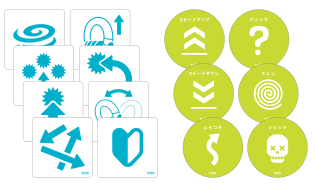
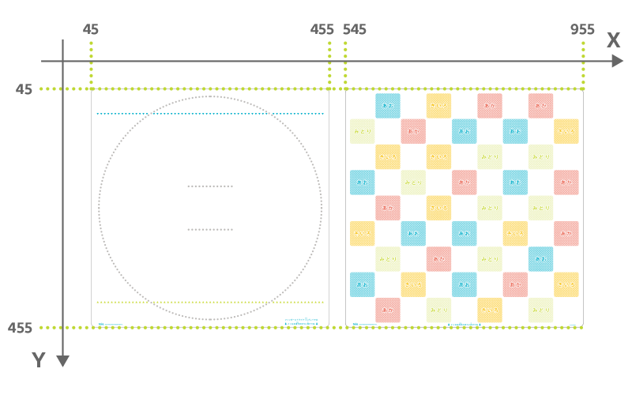
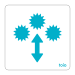
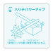
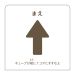
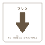

[トイオ・コレクション](https://toio.io/titles/toio-collection.html)に付属するマットやカードには特殊なパターンが印刷されています。これを toio ID と呼びます。キューブは底面にある「読み取りセンサー」でそのパターンから固有の情報を読み取り、印刷物上での位置の特定（絶対位置検出）を行います。

読み取りセンサーが toio ID から読み取る情報は以下の特性（characteristic）を使うことで取得できます。

| プロパティ          | 値                                     |
| ------------------- | -------------------------------------- |
| Characteristic UUID | 10B20101-5B3B-4571-9508-CF3EFCD7BBAE   |
| Properties          | [Read](#読み出し操作), [Notify](#通知) |
| Descriptor          | ID Information                         |

## toio ID の種類

toio ID には Position ID と Standard ID の 2 種類があり、それぞれ以下のように取得できる情報が異なります。

| toio ID の種類 | 印刷されているモノの例                                                      | 取得できる情報               |
| -------------- | --------------------------------------------------------------------------- | ---------------------------- |
| Position ID    | マット                                   | キューブの位置と角度         |
| Standard ID    | カードやステッカー  | ユニークな値とキューブの角度 |

## 読み出し操作

### Position ID

キューブがマットに印刷された Position ID から受け取った情報を、以下に示す構成のデータで取得できます。

| データ位置 | タイプ | 内容                        | 例                                       |
| ---------- | ------ | --------------------------- | ---------------------------------------- |
| 0          | UInt8  | 情報の種類                  | `0x01`（Position ID） |
| 1          | UInt16 | キューブの中心の X 座標値   | `0x02c5`（709）                          |
| 3          | UInt16 | キューブの中心の Y 座標値   | `0x017f`（383）                          |
| 5          | UInt16 | キューブの角度              | `0x0132`（306 度）                       |
| 7          | UInt16 | 読み取りセンサーの X 座標値 | `0x02bc`（700）                          |
| 9          | UInt16 | 読み取りセンサーの Y 座標値 | `0x0182`（386）                          |
| 11         | UInt16 | 読み取りセンサーの角度      | `0x0132`（306 度）                       |

#### 座標（X 座標、Y 座標）

X 座標および Y 座標は Position ID が印刷されたマットの上での位置を示す座標です。
toio ID 独自に定義されているもので、単位は**ミリメートルではありません**。
トイオ・コレクションのマットには以下のような座標が割り振られています。

#### 角度

角度はマット上での向きです。以下の図において X 軸方向が 0 度で時計回りが正となる値です。
値の範囲は 0 度から 360 度です。

### Standard ID

キューブがカードやステッカーなどに印刷された Standard ID から受け取った情報を、以下に示す構成のデータで取得できます。

| データ位置 | タイプ | 内容             | 例                                       |
| ---------- | ------ | ---------------- | ---------------------------------------- |
| 0          | UInt8  | 情報の種類       | `0x02`（Standard ID） |
| 1          | UInt32 | Standard ID の値 | `0x00380000` （3670016: タイフーン） |
| 5          | UInt16 | キューブの角度   | `0x0015`（21 度）                        |

#### Standard ID の値

トイオ・コレクションに含まれる Standard ID が印刷されたアイテムと取得できる値の一覧は以下のとおりです。
この値を取得することでキューブがどのアイテムの上に置かれているかを判断できます。

| 名前                            | カード・ステッカー                                                                                                                      | 値      |
| ------------------------------- | --------------------------------------------------------------------------------------------------------------------------------------- | ------- |
| タイフーン                      |                                              | 3670016 |
| ラッシュ                        |                                                        | 3670054 |
| オートタックル                  |                              | 3670018 |
| ランダム                        |                                                    | 3670056 |
| ツキパワーアップ                |                  | 3670020 |
| ハリテパワーアップ              |  | 3670058 |
| サイドアタック                  |                              | 3670022 |
| イージーモード                  |                      | 3670060 |
| ひだり                          |                                                                                                     | 3670024 |
| みぎ                            |                                                                                                      | 3670062 |
| まえ                            |                                                                                                      | 3670026 |
| うしろ                          |                                                                                                     | 3670064 |
| GO                              |                                                                                                           | 3670028 |
| スカンク（青色）                |                                                                                            | 3670078 |
| スカンク（緑色）                |                                                                                           | 3670042 |
| スカンク（黄色）                |                                                                                          | 3670080 |
| スカンク（オレンジ色）          |                                                                                          | 3670044 |
| スカンク（赤色）                |                                                                                             | 3670082 |
| スカンク（茶色）                |                                                                                           | 3670046 |
| スピードアップ                  |                                                                                        | 3670066 |
| スピードダウン                  |                                                                                      | 3670030 |
| ふらつき                        |                                                                                                | 3670068 |
| パニック                        |                                                                                                 | 3670032 |
| スピン                          |                                                                                                    | 3670070 |
| ショック                        |                                                                                                 | 3670034 |
| クラフトファイター              |                                                                                  | 3670048 |
| リズム＆ゴー                    |                                                                                        | 3670052 |
| スカンクチェイサー              |                                                                                   | 3670086 |
| フィンガーストライク            |                                                                                | 3670050 |
| フィンガーストライク 1 人プレイ |                                                                   | 3670088 |
| フリームーブ                    |                                                                                            | 3670084 |

#### キューブの角度

キューブの角度は Standard ID が印刷されたアイテム上でのキューブの向きです。
値の範囲は 0 度から 360 度です。

### Position ID missed

キューブが Position ID の印刷されたマットの上から取り除かれたという情報を、以下に示す構成のデータで取得できます。

| データ位置 | タイプ | 内容       | 例                                              |
| ---------- | ------ | ---------- | ----------------------------------------------- |
| 0          | UInt8  | 情報の種類 | `0x03`（Position ID missed） |

### Standard ID missed

キューブが Standard ID の印刷されたカードやシールの上から取り除かれたという情報を、以下に示す構成のデータで取得できます。

| データ位置 | タイプ | 内容       | 例                                              |
| ---------- | ------ | ---------- | ----------------------------------------------- |
| 0          | UInt8  | 情報の種類 | `0x04`（Standard ID missed） |

## 通知

読み取りセンサーの読み取る情報が変化すると、この特性は BLE セントラルに情報を通知します。
通知される情報の内容とデータの構造は[読み出し操作](#読み出し操作)で得られるものと同じです。
