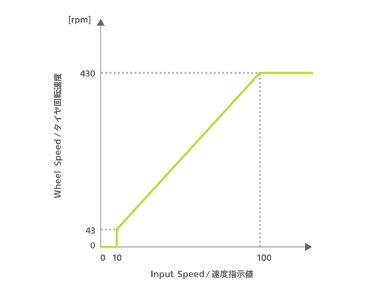

キューブは 2 つのモーターを持ち、それぞれが左右の車輪につながっています（参考：[各部の名前](hardware_components.md)）。
これらのモーターは以下の特性（characteristic）を使うことで制御できます。

| プロパティ          | 値                                      |
| ------------------- | --------------------------------------- |
| Characteristic UUID | 10B20102-5B3B-4571-9508-CF3EFCD7BBAE    |
| Properties          | [Write without response](#書き込み操作) |
| Descriptor          | Motor Control                           |

## 書き込み操作

### モーター制御

以下に示す構成のデータを書き込むことでモーターを制御できます。 次の書き込み操作が行われるまで、モーターは指定した速度で動きづづけます。

| データ位置 | タイプ | 内容                  | 例                                        |
| ---------- | ------ | --------------------- | ----------------------------------------- |
| 0          | UInt8  | 制御の種類            | `0x01`（モーター制御） |
| 1          | UInt8  | 制御するモーターの ID | `0x01`（左）                              |
| 2          | UInt8  | モーターの回転方向    | `0x01`（前）                              |
| 3          | UInt8  | モーターの速度指示値  | `0x64`（100）                             |
| 4          | UInt8  | 制御するモーターの ID | `0x02`（右）                              |
| 5          | UInt8  | モーターの回転方向    | `0x02`（後ろ）                            |
| 6          | UInt8  | モーターの速度指示値  | `0x14`（20）                              |

#### 制御するモーターの ID

制御するモーターの ID を指定します。左のモーターの ID が`1`で右のモーターの ID が`2`です。
モーターの ID を指定する場所は二箇所ありますが、両方で同じ ID を指定するとエラーになり書き込み操作は無視されます。

#### モーターの回転方向

直前で指定した ID のモーターに対して回転方向を指定します。
キューブの前進する方向が`1`で後退する方向が`2`です。

#### モーターの速度指示値

直前で指定した ID のモーターに対して回転の速度を指定します。
モーターの速度指示値は`0`以上`255`以下の範囲で指定できますが、モーターの速度指示値と実際のタイヤの回転速度の関係は以下のグラフのとおりです。

### 時間指定付きモーター制御

以下に示す構成のデータを書き込むことで動かす時間を指定してモーターを制御できます。
指定した時間を経過するとモーターは停止します。

| データ位置 | タイプ | 内容                  | 例                                                    |
| ---------- | ------ | --------------------- | ----------------------------------------------------- |
| 0          | UInt8  | 制御の種類            | `0x02`（時間指定付きモーター制御） |
| 1          | UInt8  | 制御するモーターの ID | `0x01`（左）                                          |
| 2          | UInt8  | モーターの回転方向    | `0x01`（前）                                          |
| 3          | UInt8  | モーターの速度指示値  | `0x64`（100）                                         |
| 4          | UInt8  | 制御するモーターの ID | `0x02`（右）                                          |
| 5          | UInt8  | モーターの回転方向    | `0x02`（後）                                          |
| 6          | UInt8  | モーターの速度指示値  | `0x14`（20）                                          |
| 7          | UInt8  | モーターの制御時間    | `0x0A`（100 ミリ秒）                                  |

#### モーターの制御時間

モーターを動かす時間を`0`以上`255`以下の範囲で指定します。`0`は「時間制限無し」を意味し、[モーター制御](#モーター制御)と同様に次の書き込み操作が行われるまで、モーターは指定した速度で動きづづけます。`1`以上`255`以下の範囲では x10 ミリ秒モーターは動いたあと停止します。
