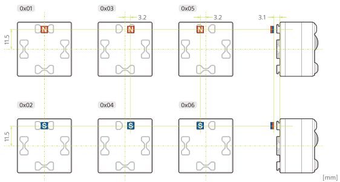

キューブのシステムソフトウェアバージョン v02.004 (BLE プロトコルバージョン v2.2.0)から磁気センサーを利用できます。未装着および以下の仕様に従う 6 つのパターン、合計 7 つパターンを検出できます。通信仕様については[通信仕様 - 磁気センサー](magnetic_sensor.md)を参照してください。

磁気センサーは内部で磁束密度を 3 次元的に捉えることで磁石を検出しています。磁束密度の検出には範囲があり、範囲の外では正しく検出されません。ご利用の磁石を用いて必ず実機・実環境であらかじめ試験の上ご利用ください。

> **注意**
>
> - 強力な磁石の使用はキューブの正常な動作が妨げられたり、故障につながることがあります。ご注意ください。
> - 磁石の扱いに関しては、必ず磁石メーカーの取扱説明書をよく読んで利用上の注意を守り、知識を持った方が責任を持ってお取り扱いください。

## **磁石の仕様**

磁石の仕様は以下のとおりです。

| 項目     | 内容                 |
| -------- | -------------------- |
| サイズ   | 4 x 4 x 2 [mm]       |
| 材質     | ネオジム焼結磁石 N40 |
| 着磁方向 | 2mm 厚方向           |

## **磁石のレイアウト仕様**

磁石位置・着磁方向に応じて下図の 6 パターンを検出できます。

