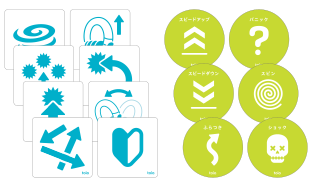
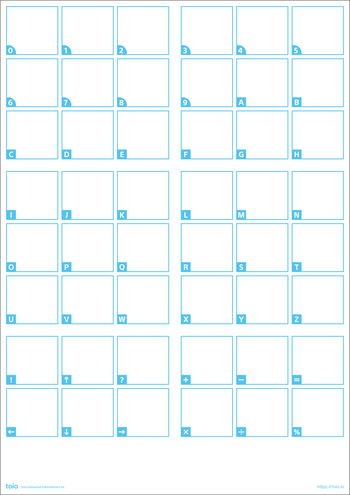
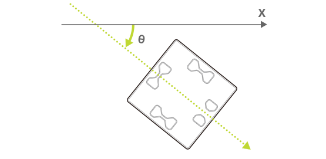

[トイオ・コレクション](https://toio.io/titles/toio-collection.html)に付属する「プレイマット」や「各種カード・シート」、[toio コア キューブ（単体）](https://toio.io/cube)に付属する「簡易プレイマット」「簡易カード」には特殊なパターンが印刷されています。これを toio ID と呼びます。キューブは底面にある「読み取りセンサー」でそのパターンから固有の情報を読み取り、印刷物上での位置の特定（絶対位置検出）を行います。

読み取りセンサーが toio ID から読み取る情報は以下の特性（characteristic）を使うことで取得できます。

| プロパティ          | 値                                     |
| ------------------- | -------------------------------------- |
| Characteristic UUID | 10B20101-5B3B-4571-9508-CF3EFCD7BBAE   |
| Properties          | [Read](#読み出し操作), [Notify](#通知) |
| Descriptor          | ID Information                         |

## toio ID の種類

toio ID には Position ID と Standard ID の 2 種類があり、それぞれ以下のように取得できる情報が異なります。詳細についてはそれぞれのページを参照してください。

- [Position ID 一覧](info_position_id.md)
- [Standard ID 一覧](info_standard_id.md)

| toio ID の種類 | 印刷されているモノの例                                                                                                                                                                                                                                  | 取得できる情報               |
| -------------- | ------------------------------------------------------------------------------------------------------------------------------------------------------------------------------------------------------------------------------------------------------- | ---------------------------- |
| Position ID    | トイオ・コレクションに付属のプレイマット  toio コア キューブ（単体）に付属の簡易プレイマット     | キューブの位置と角度         |
| Standard ID    | トイオ・コレクションに付属の各種カード・シート  toio コア キューブ（単体）に付属の簡易カード   | ユニークな値とキューブの角度 |

## 読み出し操作

### Position ID

キューブが Position ID から受け取った情報を、以下に示す構成のデータで取得できます。
通知の間隔や条件を[設定 - 読み取りセンサーの ID 通知設定](configuration.md#読み取りセンサーの-id-通知設定)で変更できます。

| データ位置 | タイプ | 内容                        | 例                                               |
| ---------- | ------ | --------------------------- | ------------------------------------------------ |
| 0          | UInt8  | 情報の種類                  | `0x01`（Position ID） |
| 1          | UInt16 | キューブの中心の X 座標値   | `0x02c5`（709）                                  |
| 3          | UInt16 | キューブの中心の Y 座標値   | `0x017f`（383）                                  |
| 5          | UInt16 | キューブの角度              | `0x0132`（306 度）                               |
| 7          | UInt16 | 読み取りセンサーの X 座標値 | `0x02bc`（700）                                  |
| 9          | UInt16 | 読み取りセンサーの Y 座標値 | `0x0182`（386）                                  |
| 11         | UInt16 | 読み取りセンサーの角度      | `0x0132`（306 度）                               |

:::note

バイトオーダーはリトルエンディアンです。その他データ構造の表記については、[機能の利用 - データ構造の表記](how_to_communicate.md)をご確認ください。

:::

#### 座標（X 座標、Y 座標）

X 座標および Y 座標は Position ID 上での位置を示す座標です。
toio ID 独自に定義されているもので、単位は**ミリメートルではありません**。
実際に取得できる座標については[Position ID 一覧](info_position_id.md)を参照してください。

#### 角度

角度は Position ID 上での向きです。以下の図において X 軸方向が 0 度で時計回りが正となる値です。
値の範囲は 0 度から 360 度です。

### Standard ID

キューブが Standard ID から受け取った情報を、以下に示す構成のデータで取得できます。
通知の間隔や条件を[設定 - 読み取りセンサーの ID 通知設定](configuration.md#読み取りセンサーの-id-通知設定)で変更できます。

| データ位置 | タイプ | 内容             | 例                                               |
| ---------- | ------ | ---------------- | ------------------------------------------------ |
| 0          | UInt8  | 情報の種類       | `0x02`（Standard ID） |
| 1          | UInt32 | Standard ID の値 | `0x00380000` （3670016: タイフーン）         |
| 5          | UInt16 | キューブの角度   | `0x0015`（21 度）                                |

:::note

バイトオーダーはリトルエンディアンです。その他データ構造の表記については、[機能の利用 - データ構造の表記](how_to_communicate.md)をご確認ください。

:::

#### Standard ID の値

Standard ID からはキューブの位置に寄らないユニークな値を取得できます。この値を使うことでキューブがどのアイテムの上に置かれているかを判断できます。実際に取得できる値については[Standard ID 一覧](info_standard_id.md)を参照してください。

#### キューブの角度

キューブの角度は Standard ID 上でのキューブの向きです。値の範囲は 0 度から 360 度です。

### Position ID missed

キューブが Position ID の上から取り除かれたという情報を、以下に示す構成のデータで取得できます。
通知の感度を[設定 - 読み取りセンサーの ID missed 通知設定](configuration.md#読み取りセンサーの-id-missed-通知設定)で変更できます。

| データ位置 | タイプ | 内容       | 例                                                      |
| ---------- | ------ | ---------- | ------------------------------------------------------- |
| 0          | UInt8  | 情報の種類 | `0x03`（Position ID missed） |

### Standard ID missed

キューブが Standard ID の上から取り除かれたという情報を、以下に示す構成のデータで取得できます。
通知の感度を[設定 - 読み取りセンサーの ID missed 通知設定](configuration.md#読み取りセンサーの-id-missed-通知設定)で変更できます。

| データ位置 | タイプ | 内容       | 例                                                      |
| ---------- | ------ | ---------- | ------------------------------------------------------- |
| 0          | UInt8  | 情報の種類 | `0x04`（Standard ID missed） |

## 通知

読み取りセンサーの読み取る情報が変化すると、この特性は BLE セントラルに情報を通知します。
通知される情報の内容とデータの構造は[読み出し操作](#読み出し操作)で得られるものと同じです。
