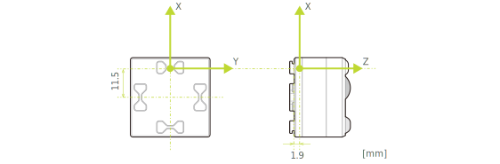

キューブの3軸磁気センサーを利用した機能として、「磁石の状態検出」と「磁力の検出」の2つの機能が利用できます。

キューブのシステムソフトウェアバージョン v02.0004 (BLE プロトコルバージョン v2.2.0)から「磁石の状態検出」が利用できます。  
キューブのシステムソフトウェアバージョン v02.0005 (BLE プロトコルバージョン v2.3.0)から上記に加えて「磁力の検出」が利用できます。

システムソフトウェアバージョンとアップデート方法については[はじめに-アップデートについて](how_to_update_cube.md)を参照してください。

通信仕様については[通信仕様 - 磁気センサー](magnetic_sensor.md)を参照してください。

> **注意**
>
> - 強力な磁石の使用はキューブの正常な動作が妨げられたり、故障につながることがあります。ご注意ください。
> - 磁石の扱いに関しては、必ず磁石メーカーの取扱説明書をよく読んで利用上の注意を守り、知識を持った方が責任を持ってお取り扱いください。

## 1. 磁石の状態検出

あらかじめ決められた位置・磁力で配置された磁石により、6パターンの状態が検出できます。  
磁束密度の検出には範囲があり、範囲の外では正しく検出されません。ご利用の磁石を用いて必ず実機・実環境であらかじめ試験の上ご利用ください。

### 磁石の仕様

磁石の仕様は以下のとおりです。

| 項目     | 内容                 |
| -------- | -------------------- |
| サイズ   | 4 x 4 x 2 [mm]       |
| 材質     | ネオジム焼結磁石 N40 |
| 着磁方向 | 2mm 厚方向           |

### 磁石のレイアウト仕様

磁石位置・着磁方向に応じて下図の 6 パターンを検出できます。

## **2. 磁力の検出**

磁力の強さと向きを検出できます。

磁力の強さは、磁石の極性とは関係なく常に正の値で表されます。

磁力の向きは、キューブを通過する磁力線の向きを、3次元ベクトルとしてX,Y,Zの成分で表したものです。
この3次元ベクトルの長さは、磁力の強さに関わらずほぼ一定（およそ10）です。

キューブの座標系は下図で、矢印方向が正の向きとなります。

