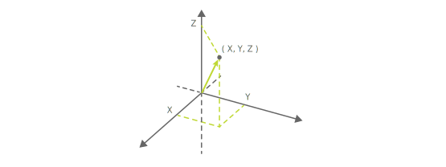

キューブは磁気センサーによってキューブの天面に装着された磁石の種類（定義済みのレイアウトパターン）または磁力を検出できます。磁石のハードウェア仕様については[ハードウェア仕様 - 磁気センサー](hardware_magnet.md)を参照してください。

> この機能は**デフォルトでは無効**になっています。[設定 - 磁気センサーの設定](configuration.md#_磁気センサーの設定_)で有効化することではじめて利用可能になります。

磁気センサーの情報は以下の特性（characteristic）を使うことで取得できます。特性は[モーション検出](sensor.md)および[姿勢角検出](high_precision_tilt_sensor.md)と同じです。

| プロパティ          | 値                                                                                 |
| ------------------- | ---------------------------------------------------------------------------------- |
| Characteristic UUID | 10B20106-5B3B-4571-9508-CF3EFCD7BBAE                                               |
| Properties          | [Write](#書き込み操作), [Read](#読み出し操作--通知), [Notify](#読み出し操作--通知) |
| Descriptor          | Sensor Information                                                                 |

## 書き込み操作

### 磁気センサー情報の要求

以下のデータを書き込むことで磁気センサー情報を要求できます。キューブは要求を受け取ると、必ず 1 回磁気センサー情報の通知を行います。

| データ位置 | タイプ | 内容       | 例                                                  |
| ---------- | ------ | ---------- | --------------------------------------------------- |
| 0          | UInt8  | 情報の種類 | `0x82` (磁気センサー情報の要求） |

## *読み出し操作 / 通知*

キューブの磁気センサーの情報が変化すると、この特性は BLE セントラルに情報を通知します。
通知される情報は読み出し操作でも取得できます。

> 特性は[モーション検出](sensor.md)および[姿勢角検出](high_precision_tilt_sensor.md)と共通です。
これらの情報も取得されますので、利用の際には[モーション検出 - 読み出し操作 / 通知](sensor.md#読み出し操作--通知)および[姿勢角検出 - 読み出し操作 / 通知](high_precision_tilt_sensor.md#読み出し操作--通知)も確認してください。

### *磁気センサー情報の取得*

| データ位置 | タイプ | 内容                        | 例                                            |
| ---------- | ------ | --------------------------- | --------------------------------------------- |
| 0          | UInt8  | 情報の種類                  | `0x02`（磁気センサー情報） |
| 1          | UInt8  | 磁石の状態                  | `0x00`（未装着または機能無効）                |
| 2          | UInt8  | 磁力の強度                  | `0x00`（検出なしまたは機能無効）              |
| 3          | Int8   | 磁力の方向（X軸）           | `0x00`（検出なしまたは機能無効）              |
| 4          | Int8   | 磁力の方向（Y軸）           | `0x00`（検出なしまたは機能無効）              |
| 5          | Int8   | 磁力の方向（Z軸）           | `0x00`（検出なしまたは機能無効）              |

#### 磁石の状態

キューブの天面に装着された磁石の状態（未装着もしくは定義済みのレイアウトパターン）の ID です。未装着時は`0x00`になり、装着時は`0x01`から`0x06`の 6 つのパターンのいずれかになります。レイアウトパターンの仕様については[ハードウェア仕様 - 磁気センサー](hardware_magnet.md)を参照してください。

未装着もしくは[ハードウェア仕様 - 磁気センサー](hardware_magnet.md)で定義されている 6 つのパターン、合わせて 7 つのパターン以外の磁力を検出した場合は情報を更新しません。

#### **磁力の検出**

キューブに磁石を近づけると、キューブは磁力を検出して応答を返します。
##### 磁力の強度

磁力の強度は、キューブが検出した磁力の強さを表します。  
強度の値の範囲は0から255です。値が大きいほど磁力が強いことを示します。

##### 磁力の方向

磁力の方向は、キューブに対する磁力線の向きを相対的に示します。  
各軸の値の範囲は -10 から 10 です。磁力を検出していないときは 0 です。
磁力の方向の3次元ベクトルとしての長さは、磁力の強度に比例しません。
磁力を検出したときのベクトルの長さはほぼ一定（およそ 10）です。

キューブの方向と磁力線の方向の関係は[ハードウェア仕様 - 磁気センサー](hardware_magnet.md#磁力の検出)を参照してください。

