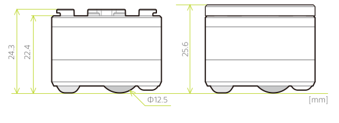
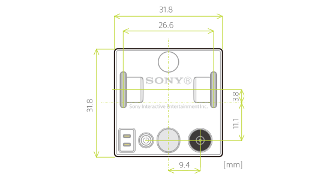

キューブの形状およびサイズについて紹介します。単位は全てミリメートルです。

## 3D データ

キューブの外形形状は以下よりダウンロード可能です。

import { ModelDownloadButtonGroup } from '@site/src/components/ModelDownloadButtonGroup'

<ModelDownloadButtonGroup />

import { Cube3DView } from '@site/src/components/Cube3DView'

  <Cube3DView />

:::note

キューブの 3D データは[クリエイティブ・コモンズ 表示-改変禁止 4.0 国際 パブリック・ライセンス](https://creativecommons.org/licenses/by-nd/4.0/)でライセンスされます。詳しくは[こちら](about.md#ライセンス)をご確認ください。

:::

## マウント形状

キューブの上面の突起は一般的なブロックが接続可能です。

## 側面

キューブ本体およびトッププレートを付けた場合の側面から見たサイズは以下の図のとおりです。

## 底面

キューブ底面の各部の配置は以下の図のとおりです。

