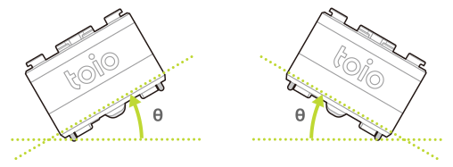

キューブはモーションセンサー（6 軸検出システム）によってキューブの姿勢や衝突などの状態情報を検出できます。

これらの情報は以下の特性（characteristic）を使うことで取得できます。特性は[磁気センサー](magnetic_sensor.md)および[姿勢角検出](high_precision_tilt_sensor.md)と同じです。

| プロパティ          | 値                                                                                 |
| ------------------- | ---------------------------------------------------------------------------------- |
| Characteristic UUID | 10B20106-5B3B-4571-9508-CF3EFCD7BBAE                                               |
| Properties          | [Write](#書き込み操作), [Read](#読み出し操作--通知), [Notify](#読み出し操作--通知) |
| Descriptor          | Sensor Information                                                                 |

## 書き込み操作

### モーション検出情報の要求

以下のデータを書き込むことでモーション検出情報を要求できます。キューブは要求を受け取ると、必ず 1 回モーション検出情報の通知を行います。

| データ位置 | タイプ | 内容       | 例                                                            |
| ---------- | ------ | ---------- | ------------------------------------------------------------- |
| 0          | UInt8  | 情報の種類 | `0x81` (モーション検出情報の要求） |

## 読み出し操作 / 通知

キューブのモーションセンサーの情報が変化すると、この特性は BLE セントラルに情報を通知します。通知される情報は読み出し操作でも取得できます。

:::note

特性は[磁気センサー](magnetic_sensor.md)および[姿勢角検出](high_precision_tilt_sensor.md)と共通です。これらの情報も取得されますので、利用の際には[磁気センサー - 読み出し操作 / 通知](magnetic_sensor.md#読み出し操作--通知)および[姿勢角検出 - 読み出し操作 / 通知](high_precision_tilt_sensor.md#読み出し操作--通知)も確認してください。

:::

### モーション検出情報の取得

キューブのモーション検出の情報を以下に示す構成のデータで取得できます。

| データ位置 | タイプ | 内容             | 例                                        |
| ---------- | ------ | ---------------- | ----------------------------------------- |
| 0          | UInt8  | 情報の種類       | `0x01`（検出） |
| 1          | UInt8  | 水平検出         | `0x00`（水平ではない）                    |
| 2          | UInt8  | 衝突検出         | `0x00`（衝突なし）                        |
| 3          | UInt8  | ダブルタップ検出 | `0x00`（ダブルタップなし）                |
| 4          | UInt8  | 姿勢検出         | `0x01`（正位置）                          |
| 5          | UInt8  | シェイク検出     | `0x00`（シェイクなし）                    |

#### 水平検出

キューブが水平な時は`0x01`（水平）、キューブが一定の角度（下図の θ）より傾いた時に`0x00`（水平ではない）になります。角度のしきい値については[設定 - 水平検出のしきい値設定](configuration.md#水平検出のしきい値設定)で設定可能です。

ロール方向

ピッチ方向

#### 衝突検出

キューブと何かが衝突したときに`0x00`（衝突なし）から`0x01`（衝突あり）に変わります。
検出される衝突の大きさのしきい値については[設定 - 衝突検出のしきい値設定](configuration.md#衝突検出のしきい値設定)で設定可能です。

#### ダブルタップ検出

キューブが一度タップされてから一定時間内に再度タップされると、`0x00`（ダブルタップなし）から`0x01`（ダブルタップあり）に変わります。タップの時間間隔は[設定 - ダブルタップ検出のしきい値設定](configuration.md#ダブルタップ検出の時間間隔の設定)で設定可能です。また、検出するタップの強さは[設定 - 衝突検出のしきい値設定](configuration.md#衝突検出のしきい値設定)の設定と同じです。

#### 姿勢検出

キューブの水平面に対する姿勢が変化したときに値が変わります。それぞれ値と姿勢の関係は以下のとおりです。

| 値  | キューブの姿勢 |
| --- | -------------- |
| `1` | 天面が上       |
| `2` | 底面が上       |
| `3` | 背面が上       |
| `4` | 正面が上       |
| `5` | 右側面が上     |
| `6` | 左側面が上     |

キューブの姿勢: 左から<code>1: 天面が上</code>と<code>2: 底面が上</code>

キューブの姿勢: 左から<code>3: 背面が上</code>と<code>4: 正面が上</code>

キューブの姿勢: 左から<code>5: 右側面が上</code>と<code>6: 左側面が上</code>

#### シェイク検出

キューブを振ると`0x00`（検出なし）から振った強さに応じて`0x01`（Level 1）から`0x0a`（Level 10）の値に変わります。
